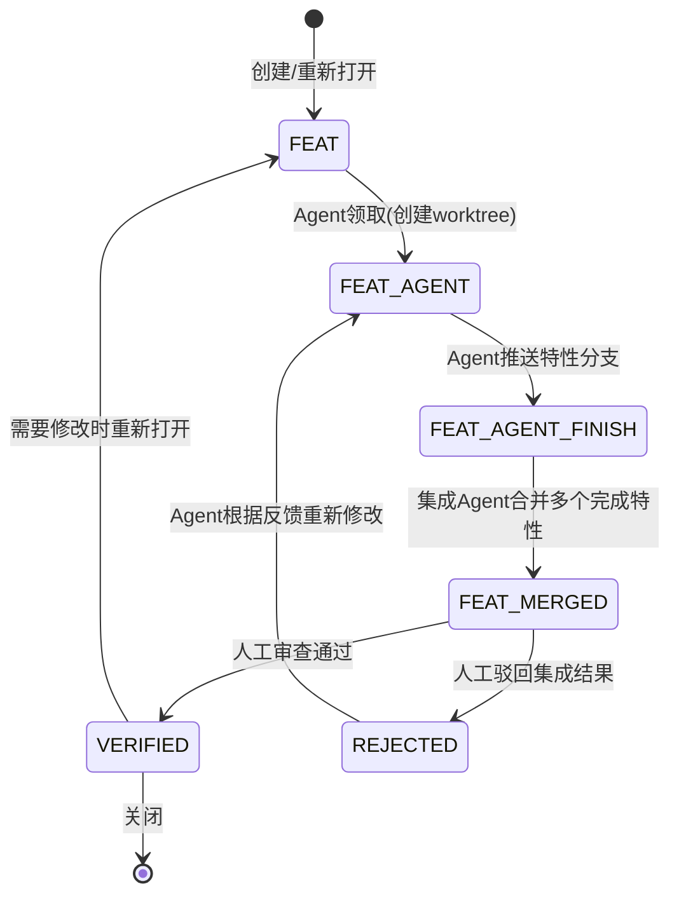

# Feat 工作流说明文档

本文档用于跟踪新功能的开发、集成与审查流程。所有特性需求以列表形式记录在下方 [FEAT 列表] 区域，Code Agent 与人工审查者根据此清单协同工作。本流程加入了 Git Worktree 机制(你可以参考多个skills使用worktree的方法和思想)，允许多个 Agent 在隔离环境中并行开发，最终由集成 Agent 统一合并后再进入人工审查。

## 状态定义

| 状态标记 | 含义 | 通常由谁设置 |
|----------|------|------------|
| `FEAT` | 新提出或重新打开的特性需求，尚未指派给 Agent | 人工 / Agent |
| `FEAT_AGENT` | Agent 正在独立 worktree 中开发此特性（占用状态） | Agent |
| `FEAT_AGENT_FINISH` | Agent 完成独立开发，等待集成（特性分支已推送） | Agent |
| `FEAT_MERGED` | 集成 Agent 已完成多个特性的合并与初步验证，等待人工最终审查 | 集成 Agent |
| `VERIFIED` | 人工审查通过，特性合并至主分支并关闭 | 人工 |
| `REJECTED` | 人工审查驳回（集成结果）或单个特性被驳回，需要 Agent 重新修改 | 人工 |

## 角色与权限

### 开发 Agent （普通 Agent）
- 每个特性通常由一名开发 Agent 在独立 worktree 中完成。
- **允许的状态转换**：
    - （新建） -> `FEAT` （用户明确提出新功能需求时记录）
    - `FEAT` -> `FEAT_AGENT` （领取任务，创建专属 worktree）
    - `FEAT_AGENT` -> `FEAT_AGENT_FINISH` （推送特性分支，提交成果）
    - `REJECTED` -> `FEAT_AGENT` （根据驳回意见修复后重新开始）
    - `VERIFIED` -> `FEAT` （已验证的功能需要重新修改或增强，重新打开）

### 集成 Agent
- 负责在多个特性开发完成后，**创建集成 worktree**，合并所有特性分支，解决冲突并执行初步测试。
- 通常由一名经验丰富的 Agent 或人工指定担任。
- **允许的状态转换**：
    - 多个 `FEAT_AGENT_FINISH` -> 将它们标记为 `FEAT_MERGED` （开始集成，合并到集成分支）
    - `FEAT_MERGED` -> `FEAT_AGENT_FINISH` （若集成失败回退至某个特性，需要该特性重新修改）
    - `FEAT_MERGED` -> `VERIFIED` （**无权限**，仅人工可执行）

### 人工审查者
- **允许的状态转换**：
    - （新建） -> `FEAT` （提出新功能需求）
    - `FEAT_MERGED` -> `VERIFIED` （确认集成结果符合预期，合并至主分支）
    - `FEAT_MERGED` -> `REJECTED` （驳回集成结果，附带全局修改意见）
    - `FEAT_AGENT_FINISH` -> `REJECTED` （直接驳回单个特性，无需等待集成）
    - 在特殊情况下，人工也可直接对 `FEAT_AGENT_FINISH` 进行预审并提前驳回。

## 通用流程（含 Git Worktree 协作）



## 技能与工具索引

本工作流涉及以下技能（Skills）和工具（Tools）。各 Agent 在执行对应步骤时，**必须**按引用调用，不得跳过或替代。

| 技能 / 工具 | 用途 | 适用阶段 | 执行者 |
|---|---|---|---|
| `using-git-worktrees` | Worktree 隔离开发最佳实践（检测、创建、清理） | Step 0 ~ Step 1 | 开发 Agent / 集成 Agent |
| `EnterWorktree` / `ExitWorktree` | 原生 worktree 进入 / 退出工具 | Step 1a | 开发 Agent / 集成 Agent |
| `writing-plans` | 复杂特性的实现规划与架构设计 | `FEAT` -> `FEAT_AGENT` | 开发 Agent（领取任务前） |
| `executing-plans` | 按规划分阶段执行开发 | Step 2 | 开发 Agent |
| `test-driven-development` | 测试驱动开发（先写测试，再实现） | Step 2 | 开发 Agent |
| `verification-before-completion` | 完成前的验证流程（检查清单、回归测试） | `FEAT_AGENT` -> `FEAT_AGENT_FINISH` | 开发 Agent |
| `requesting-code-review` | 请求代码审查（生成 PR、描述、测试计划） | `FEAT_AGENT_FINISH` | 开发 Agent |
| `receiving-code-review` | 接收审查反馈并迭代修复 | `REJECTED` -> `FEAT_AGENT` | 开发 Agent |
| `dispatching-parallel-agents` | 多 Agent 并行开发调度与管理 | 多 `FEAT` 并行时 | 集成 Agent / 人工 |

### 技能调用时机详解

- **`using-git-worktrees`**：任何 Agent 在操作 worktree 之前**必须先调用此技能**，遵循其 Step 0 检测 -> Step 1a 原生工具 -> Step 1b 手动回退的流程。
- **`writing-plans`** + **`executing-plans`**：当特性涉及 3+ 文件修改、架构变更或复杂逻辑时，开发 Agent 在领取任务后必须先调用 `writing-plans` 生成实现计划，获得用户确认后再按 `executing-plans` 执行。
- **`test-driven-development`**：新特性开发必须遵循 TDD 流程：RED（写测试）-> GREEN（实现通过）-> REFACTOR（重构）-> COVERAGE（验证 >=80%）。
- **`verification-before-completion`**：在将 `FEAT_AGENT` 改为 `FEAT_AGENT_FINISH` 之前，必须调用此技能完成验证检查清单，确保基线测试通过、无回归。
- **`dispatching-parallel-agents`**：当需要同时开发多个独立特性时，由集成 Agent 或人工调用此技能，并行派发开发 Agent，每个 Agent 在独立 worktree 中工作。

## Git Worktree 工作流说明

本工作流遵循 **using-git-worktrees** skill 的最佳实践，核心原则是：**先检测现有隔离环境，优先使用原生工具，再回退到手动 git worktree。**

### Step 0: 检测现有隔离环境（防嵌套）

任何 Agent 在创建 worktree 之前，**必须**先运行以下检测：

```bash
GIT_DIR=$(cd "$(git rev-parse --git-dir)" 2>/dev/null && pwd -P)
GIT_COMMON=$(cd "$(git rev-parse --git-common-dir)" 2>/dev/null && pwd -P)
```

- **若 `GIT_DIR != GIT_COMMON`（且不在子模块中）**：说明已处于隔离 worktree 中。**禁止**再创建嵌套 worktree，直接使用当前环境。
- **若 `GIT_DIR == GIT_COMMON`**：说明处于正常仓库，继续下一步。

> **子模块保护**：若 `git rev-parse --show-superproject-working-tree` 返回路径，说明你在子模块中，应按正常仓库处理。

### Step 1: 创建隔离工作区（优先原生工具）

#### 1a. 原生 Worktree 工具（优先）

当前环境提供原生 worktree 工具：`EnterWorktree` 和 `ExitWorktree`。Agent **必须优先使用**这些工具：

- 开发 Agent 领取任务后，调用 `EnterWorktree` 创建隔离环境并自动切换目录。
- 完成后调用 `ExitWorktree` 退出并清理。

> **严禁**：在有原生工具的情况下仍手动执行 `git worktree add`。

#### 1b. Git Worktree 手动回退（仅当无原生工具时）

若原生工具不可用，才允许手动创建 worktree。

**目录选择优先级**（由高到低）：
1. 项目已有的 `.worktrees/` 目录（隐藏目录优先）
2. 项目已有的 `worktrees/` 目录
3. 全局历史路径：`~/.config/superpowers/worktrees/<项目名>/`
4. 默认：项目根目录下的 `.worktrees/`

**安全检查（仅项目本地目录）**：

创建前必须验证目录已被 `.gitignore` 忽略：

```bash
git check-ignore -q .worktrees 2>/dev/null || git check-ignore -q worktrees 2>/dev/null
```

- **若未忽略**：先将目录加入 `.gitignore` 并提交，再继续创建 worktree。
- **原因**：防止 worktree 内容被意外提交到仓库。

**创建命令示例**：

```bash
project=$(basename "$(git rev-parse --show-toplevel)")
branch="feature/<特性名>"
path=".worktrees/$branch"
git worktree add "$path" -b "$branch"
cd "$path"
```

> **沙盒回退**：若 `git worktree add` 因权限错误失败，说明沙盒阻止了 worktree 创建。此时应在当前目录直接工作，并告知用户。

### Step 2: 独立开发

Agent 在隔离 worktree 内完成编码，**完成后必须执行自测**：

1. **项目设置自动检测**：根据项目类型运行对应命令
   - PlatformIO: `pio run -e m5stick-c`
   - Node.js: `npm install`
   - Rust: `cargo build`
   - Python: `pip install -r requirements.txt` 或 `poetry install`
2. **基线验证**：运行项目对应的测试套件
   - PlatformIO Native: `pio test -e native`
   - Node.js: `npm test`
   - Rust: `cargo test`
3. **推送特性分支**：`git push -u origin feature/<特性名>`
4. **更新条目状态**：将 `FEAT_AGENT` 改为 `FEAT_AGENT_FINISH`

> **若基线测试失败**：Agent 必须在提交成果前报告失败原因，并询问是否继续。禁止在测试未通过的情况下标记为 `FEAT_AGENT_FINISH`。

### Step 3: 集成触发

当一组关联特性均为 `FEAT_AGENT_FINISH` 时，集成 Agent 执行合并：

1. **创建集成 worktree**（遵循 Step 0-1 的隔离规范）
2. 基于主分支拉取最新代码
3. 按依赖顺序合并所有目标特性分支，解决冲突
4. **集成后冒烟测试**：运行完整的构建和测试流程，确认无重大缺陷
5. **标记状态**：将所有涉及条目改为 `FEAT_MERGED`，并附上：
   - 合并后的分支名（如 `integration/v2.3`）
   - 测试通过概况
   - 已知冲突及解决方案简述

### Step 4: 人工审查

审查者在集成 worktree 或基于集成分支的环境中验证功能：

- 通过 -> `VERIFIED`
- 驳回 -> `REJECTED`，必须在反馈中指明：
  - 是**整体架构问题**（集成 Agent 处理）
  - 还是**某个具体特性的缺陷**（对应开发 Agent 处理）

### Step 5: 发布与清理

`VERIFIED` 后：

1. 集成 Agent 将集成分支合并至主分支
2. 删除所有相关 worktree（开发 worktree + 集成 worktree）
3. 条目使用删除线标记关闭

> **Worktree 清理检查清单**：
> - [ ] 特性分支已合并到主分支
> - [ ] 开发 worktree 已删除（`git worktree remove <path>`）
> - [ ] 集成 worktree 已删除
> - [ ] 远程特性分支已删除（可选）

## Feat 列表格式规范

- [FEAT] 用户个人资料页面的需求描述
- [FEAT_AGENT] 订单导出CSV功能的需求描述
- [FEAT_AGENT_FINISH] 消息推送通知功能的需求描述
- [FEAT_MERGED] 搜索过滤器与排序联动整合（涉及 #12、#15 特性）
    - 集成概要：已合并至 `integration/search_v2`，轻量测试通过，等待人工全量审查
- [REJECTED] 夜间模式切换功能的需求描述
    - 审查意见：颜色对比度不足，需提供高对比度选项
- [VERIFIED] ~~管理员仪表盘图表功能的需求描述~~

**规则**：
- `[REJECTED]` 条目下必须缩进书写人工审查的具体反馈或修改要求。
- `[VERIFIED]` 条目描述使用删除线表示关闭。
- `[FEAT_MERGED]` 条目建议附上集成概要（合并范围、测试情况等），便于人工审查者掌握上下文。
- 当 Agent 将 `VERIFIED` 重新打开时，应去掉删除线并将标记改为 `[FEAT]`，并可选说明重新打开的原因。

## 特殊情况处理

1. **冲突无法自动解决**  
   集成 Agent 在合并时若遇到难以自动解决的冲突，可将相关 `FEAT_AGENT_FINISH` 条目中的某一个或几个改为 `REJECTED`，指明冲突细节，由对应开发 Agent 协调解决。

2. **单个特性在集成前被人工驳回**  
   人工审查者有权在特性处于 `FEAT_AGENT_FINISH` 阶段直接驳回（例如代码审查中发现严重问题），此时状态变为 `REJECTED`，集成 Agent 不应合并该条目。

3. **已验证特性的再次修改**  
   若已关闭特性需要增强或修复，直接将其重新打开为 `FEAT`，进入新一轮开发流程。

4. **Worktree 管理**  
   Agent 应定期清理无用 worktree，避免积累过多环境。集成 Agent 在合并完成后应及时移除集成 worktree。

5. **PlatformIO Worktree 编译与上传**  
   本项目使用 PlatformIO 构建系统，在 worktree 隔离环境中需注意以下事项：

   - **编译缓存共享**：`platformio.ini` 中已配置 `build_cache_dir = ${platformio.core_dir}/cache/build`，所有 worktree 共享编译缓存。首次编译会下载依赖并缓存对象文件，后续 worktree 编译相同未改动的源文件时直接使用缓存，大幅缩短编译时间。
   - **worktree 中禁止上传**：`pio run -e m5stick-c --target upload` 需要独占串口设备，多个 worktree 同时上传会导致冲突。开发 Agent 在 worktree 中**只能执行编译**（`pio run -e m5stick-c`），**严禁执行上传**。
   - **上传由人工在主仓库执行**：硬件烧录应在主仓库（`main` 分支）执行，或人工在确认代码无误后手动上传。
   - **优先使用 native 测试验证**：`pio test -e native` 是桌面模拟环境，不依赖硬件，适合在 worktree 中快速验证逻辑正确性。这是 worktree 自测的首选方式。
   - **构建目录独立**：每个 worktree 的 `.pio/build/` 目录仍独立（约 210MB+），但编译缓存共享后，增量编译的对象文件不会重复。worktree 删除时 `.pio/` 目录一并清理。
   - **libdeps 保持独立**：`.pio/libdeps/` 不共享，避免不同分支使用不同版本的库导致冲突。PlatformIO 会在首次编译时自动下载所需依赖。

---

# FEAT 列表

<!-- 请按照上方格式在下方添加特性条目 -->
- [VERIFIED] ~~当前对于UI界面的控件和服务的调用还没有统一接口，例如用户在app中像调用系统ui的某个服务（比方说弹窗）就可以直接调用，而不用复杂的配置。在对这个部分重构完还需要把代码库遗留的相关旧代码全部替换成重构完毕的代码。~~
- [FEAT] 当前的架构是串行并发的，并没有并行。
    1. 支持多核调度（SMP）调度器需要能同时为两个 CPU 核心选择任务。当前Xeros 的 kern_sched_tick 是单循环，必须改造为多调度器实例或任务分配固定核心。
    2. 引入同步原语:协作式的无锁天堂将崩塌。所有共享数据（/proc 的 TCB 链表、UI 状态、消息队列）都必须用自旋锁或互斥锁保护，这会让代码复杂度剧增，和我们之前讨论的“为什么要协作式”的初衷直接矛盾。
    3. 改变任务间通信模型:不能再依赖简单的信号量令牌，而要转向消息传递或数据流管道，确保任务之间通过安全通道交换数据，而非直接读写全局变量。
