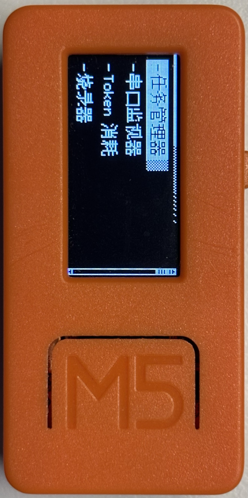
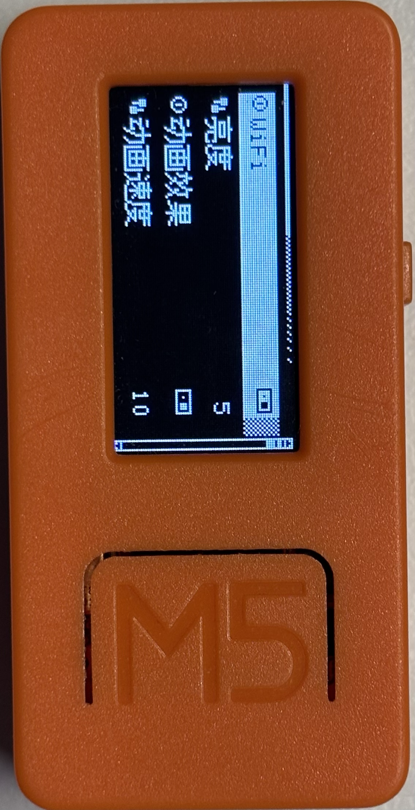
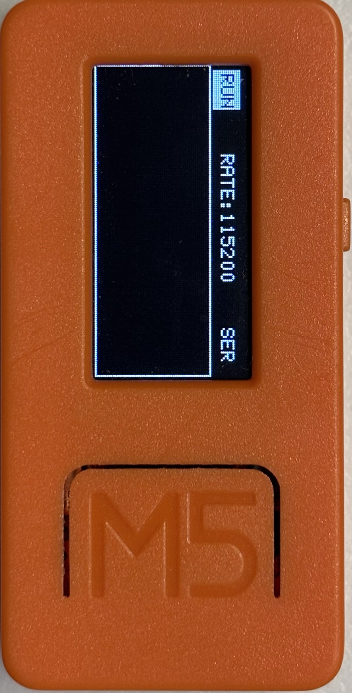
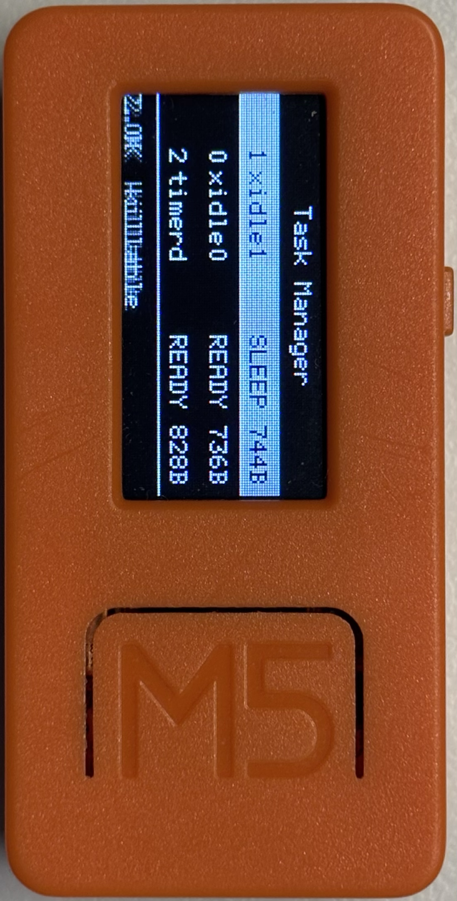
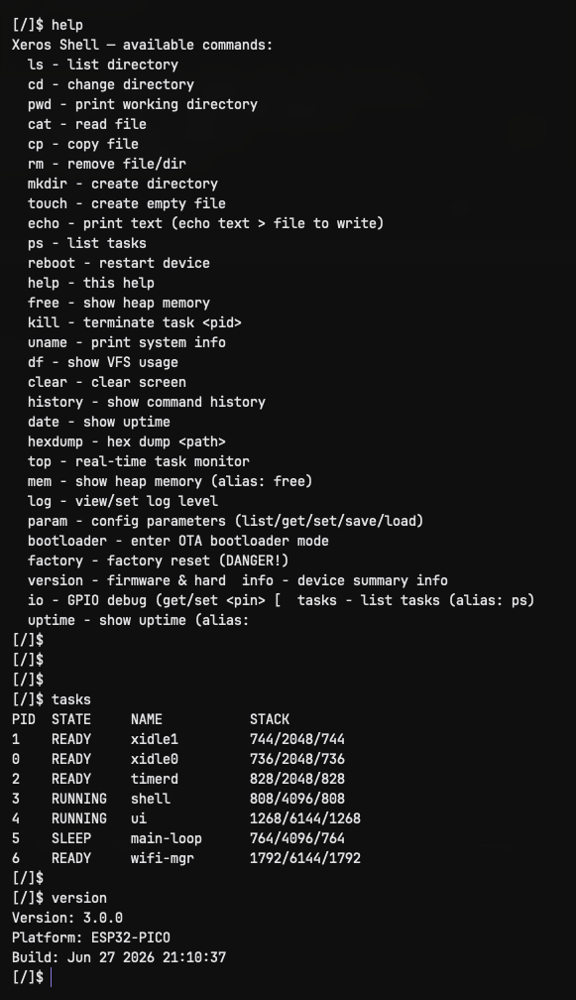

# Xerintosh

> 运行在 M5Stick-C (ESP32-PICO) 上的嵌入式操作系统，搭载自研 Xeros 微内核 v3.0.0

**开发者**: Bonerush | **版本**: Xeros Kernel v3.0.0 | **目标硬件**: M5Stick-C (ESP32-PICO)

---

## 特性概览

### Xeros 自研微内核
- 抢占式双核 SMP 调度器（RR + FIFO 优先级桶）
- Xtensa call0 ABI 汇编上下文切换
- 完整的同步原语：spinlock、递归 mutex (PI)、信号量、消息队列、事件组
- Linux 风格 VFS：`/proc/`、`/sys/`、`/dev/`、`/sys/gpio/`
- 内置交互式 Shell，66+ 命令，Tab 补全
- Tickless idle 省电模式
- MPU 栈溢出检测与看门狗

### UI 框架
- 基于 C 结构体的面向对象菜单系统
- 80x160 LCD 渲染，支持脏矩形优化
- 缓动动画、弹簧动画、退场沙漏动画
- 中文字体渲染支持
- 
   - 上图是该框架在M5stickc平台上的根菜单显示。

- 
   - 上图是该框架在M5stickc平台上的设置菜单显示。

### 应用层
- 串口监视器与串口输入
- WiFi 扫描/连接管理
- 固件 OTA/串口烧录器
- ADC 示波器
- 任务管理器
- 系统设置（亮度、动画、波特率、屏幕方向）
- 
   - 上图是该框架在M5stickc平台上的串口监视器显示。
- 
   - 上图是该框架在M5stickc平台上任务管理器显示。
---

## 硬件要求

| 组件 | 规格 |
|------|------|
| 设备 | M5Stick-C |
| SoC | ESP32-PICO (Xtensa LX6 双核 @ 240 MHz) |
| Flash | 4MB |
| 屏幕 | 80x160 SPI LCD |
| 电源管理 | AXP192 PMIC |

---

## 快速开始

### 环境准备

1. 安装 [PlatformIO](https://platformio.org/)
2. 克隆项目：
   ```bash
   git clone https://github.com/your-username/Xerintosh.git
   cd Xerintosh
   ```

### 构建与烧录

```bash
# 使用 Xeros 原生内核构建（推荐）
pio run -e m5stick-c-native

# 烧录到设备
pio run -e m5stick-c-native -t upload

# 串口监控
pio device monitor -b 115200
```

### 运行测试

```bash
# 桌面 Native 单元测试（无需硬件）
pio test -e native
```

---

## 构建环境

| Environment | 目标 | 后端 | 说明 |
|---|---|---|---|
| `m5stick-c` | M5Stick-C 硬件 | FreeRTOS | 兼容模式 |
| `m5stick-c-native` | M5Stick-C 硬件 | **Xeros 原生调度器** | 推荐使用 |
| `native` | 桌面 x86_64 | POSIX 桩 | 单元测试 |

---

## 项目架构

```
Xerintosh/
├── src/                    # 主源代码
│   ├── kernel/             # Xeros 自研内核
│   │   ├── devices/        # 内核设备（ttyS0、fb0、input0、pwrkey）
│   │   └── esp32/          # ESP32 原生后端（汇编上下文切换、IPI）
│   ├── hal/                # 硬件抽象层
│   ├── ui/                 # UI 框架
│   ├── app/                # 应用层
│   └── fonts/              # 中文字体
├── test/                   # 60+ 单元测试（GoogleTest）
├── tools/                  # 调试工具
├── doc/                    # 技术文档
├── platformio.ini          # PlatformIO 配置
└── CMakeLists.txt          # ESP-IDF CMake 入口
```

### 四层架构

| 层级 | 目录 | 职责 |
|------|------|------|
| **内核** | `src/kernel/` | 任务管理、调度、IPC、VFS、Shell |
| **HAL** | `src/hal/` | 显示、输入、电源、UART 驱动 |
| **UI** | `src/ui/` | 菜单树、动画、渲染 |
| **App** | `src/app/` | 业务应用模块 |

---

## 内核子系统

| 子系统 | 关键文件 | 功能 |
|---|---|---|
| 任务管理 | `kern_task*.c/h` | TCB、生命周期、挂起/恢复/通知 |
| 调度器 | `kern_sched*.c/h` | 抢占式 RR + FIFO 调度 |
| 同步 IPC | `kern_sync.c/h`, `kern_ipc.c/h` | mutex、信号量、消息队列 |
| 内存管理 | `kern_kmalloc.c/h` | 内核堆分配器 |
| VFS | `kern_vfs.c/h` | 虚拟文件系统 |
| Shell | `kern_shell*.c/h` | 交互式 Shell |
| SMP | `kern_smp.c/h` | 双核调度、IPI |
| 定时器 | `kern_timer.c/h` | 软件定时器 |
| 调试 | `kern_debug.c/h`, `kern_stats.c/h` | 调度追踪、运行时统计 |

---

## 调试工具

### xeros_debug.py

自研 Python 串口调试工具：

```bash
# 基本连接
python tools/xeros_debug.py

# 实时日志
python tools/xeros_debug.py --log

# SMP 核状态采样
python tools/xeros_debug.py --smp

# Tickless 统计
python tools/xeros_debug.py --tickless

# 等待特定字符串（自动化测试）
python tools/xeros_debug.py --wait "Boot complete"
```

功能：
- 串口连接 (115200 baud)
- 设备复位 (DTR/RTS)
- Shell 命令发送与输出收集
- Guru Meditation 自动检测
- 日志保存到文件

---

## 内置 Shell 命令

通过串口访问交互式 Shell，支持 66+ 命令：

```
# 系统信息
help          # 显示所有命令
version       # 内核版本
uptime        # 运行时间
meminfo       # 内存使用

# 任务管理
ps            # 任务列表
kill <pid>    # 终止任务
top           # CPU 使用率

# 文件系统
ls <path>     # 列出目录
cat <file>    # 读取文件
echo <msg>    # 输出消息

# 硬件控制
brightness <0-100>  # 屏幕亮度
gpio <pin> <0/1>    # GPIO 控制
```
- 
   - 上图是该框架在链接电脑上的shell显示。

---

## 文档

完整技术文档位于 `doc/` 目录：

| 目录 | 内容 |
|------|------|
| `doc/index.md` | 知识地图（中央索引） |
| `doc/architecture/` | 内核架构设计、上下文切换、调度器 |
| `doc/kernel/` | 内核子系统详细文档 |
| `doc/ui/` | UI 框架文档 |
| `doc/app/` | App 层文档 |
| `doc/tutorials/` | API 模板教程 |
| `doc/refactor/` | 重构记录 |

---

## 测试

- **框架**: GoogleTest
- **测试数量**: 60+ 测试文件
- **覆盖范围**: 内核、UI、HAL、App 各层
- **运行方式**: 桌面运行，无需硬件

```bash
pio test -e native
```

---

## 技术栈

| 类别 | 技术 |
|------|------|
| 语言 | C (内核/UI), C++ (HAL/App), Xtensa 汇编 |
| 框架 | ESP-IDF, PlatformIO |
| 显示库 | LovyanGFX |
| JSON | cJSON |
| 测试 | GoogleTest |

---

## 关键设计决策

1. **可插拔后端**: `kern_port_ops_t` 操作表实现 FreeRTOS/原生后端切换
2. **Xtensa call0 ABI**: 比窗口 ABI 更安全可靠
3. **SMP 双核调度**: per-CPU 独立调度器 + IPI 跨核唤醒
4. **Tickless idle**: 空闲时按需睡眠，节省功耗
5. **Linux 风格 VFS**: 统一的文件系统接口
6. **C 风格 OOP**: 结构体首字段嵌入实现多态

---

## 许可证

本项目采用 MIT 许可证 - 详见 [LICENSE](LICENSE) 文件

Copyright (c) 2026 Bonerush

---

## 相关资源与致谢

- [ESP-IDF 文档](https://docs.espressif.com/projects/esp-idf/)
- [PlatformIO 文档](https://docs.platformio.org/)
- [M5Stick-C 规格](https://docs.m5stack.com/en/core/m5stickc)
- 这里感谢[oled-ui-astra](https://github.com/AstraThreshold/oled-ui-astra.git)项目和[oled-ui-astra-lite](https://github.com/AstraThreshold/oled-ui-astra-lite.git)，带来的前端的设计参考。
- 同时也感谢freertos内核和linux内核的源码支持。

