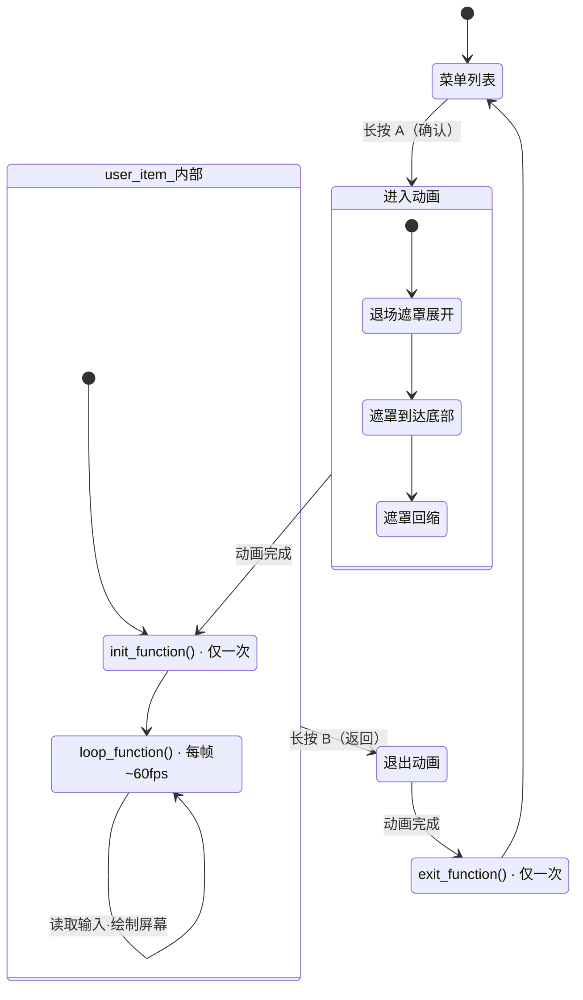

# Xerintosh UI Lite 开发者指南

> **Parent:** [知识地图](index.md) | **Related:** [编码风格规范](coding-style.md), [API 调用模板](tutorials/api-templates.md), [从零开始创建 App](tutorials/your-first-app.md)
>
> 本文档介绍如何基于 Xerintosh UI Lite 框架设计菜单结构、创建自定义 App，以及推荐的项目组织方式。
>
> 关于各模块内部实现，请参考同目录下的 `core.md`、`item.md`、`drawer.md` 及 `hal/` 下的文档。

---

## 目录

1. [框架概述](#1-框架概述)
2. [菜单树结构设计](#2-菜单树结构设计)
3. [五种菜单项类型](#3-五种菜单项类型)
4. [自定义 App（user_item）](#4-自定义-appuser_item)
5. [输入交互映射](#5-输入交互映射)
6. [代码组织建议](#6-代码组织建议)
7. [完整示例](#7-完整示例)
8. [注意事项与限制](#8-注意事项与限制)

---

## 1. 框架概述

Xerintosh UI Lite 是一个面向嵌入式设备的层级菜单框架，采用**树形数据模型** + **动画渲染引擎** + **硬件抽象层（HAL）** 的三层架构。

```
App 代码
    │
    ▼
app_init.h/c         ← 菜单树构建、管理器初始化、输入处理
settings.h/c         ← 亮度/动画/方向配置与存储
    │
    ▼
ui_item.h/c          ← 数据模型：菜单树、选择器、相机
    │
    ▼
ui_core.h/c          ← 动画引擎与主循环调度
    │
    ▼
ui_drawer.h/c        ← 渲染管线：列表、选择器、弹窗、信息栏
    │
    ▼
hal_display.h/cpp    ← 显示抽象（M5Canvas / 内存帧缓冲）
hal_input.h/cpp      ← 按键输入抽象
hal_system.h/cpp     ← 系统时钟与延时
```

开发者只需关注 **UI Item 层** 和 **App 层**：定义菜单树、实现自定义 `user_item` 的回调即可。动画、渲染、输入处理均由框架自动完成。

---

## 2. 菜单树结构设计

### 2.1 核心概念

菜单在内存中以**多叉树**形式组织：

- **根节点（root）**：由框架自动创建的隐式节点，不显示在界面上
- **子节点**：挂载在父节点下的菜单项，最多 10 个
- **层级（layer）**：根节点为 0，每向下一层 +1，最大 10 层

*📄 Source: [ui_types.h](../src/ui/ui_types.h#L84-L85)*

### 2.2 构建菜单树

所有菜单项通过 `xerintosh_push_item_to_list(parent, child)` 挂载到树上。该函数会自动：

1. 设置子节点的 `layer = parent->layer + 1`
2. 计算子节点的纵向目标坐标 `y_list_item_trg`
3. 如果是根节点的第一个子项，自动绑定到选择器和相机

*📄 Source: [ui_item_list.c](../src/ui/ui_item_list.c#L43-L68)*

```c
#include "ui/ui_item.h"

xerintosh_list_item_t* root = xerintosh_get_root_list();  // 获取（或自动创建）根节点

xerintosh_list_item_t* settings = xerintosh_new_list_item("设置", list_icon);
xerintosh_list_item_t* about    = xerintosh_new_list_item("关于", user_icon);

xerintosh_push_item_to_list(root, settings);
xerintosh_push_item_to_list(root, about);
```

### 2.3 层级示例

```
root（隐式，不显示）
├── 设置
│   ├── WiFi          [switch_item]
│   └── 亮度          [slider_item]
├── 工具
│   └── 时钟          [user_item ← 自定义App]
└── 关于              [list_item]
```

对应代码：

```c
xerintosh_list_item_t* root     = xerintosh_get_root_list();
xerintosh_list_item_t* settings = xerintosh_new_list_item("设置", list_icon);
xerintosh_list_item_t* tools    = xerintosh_new_list_item("工具", list_icon);
xerintosh_list_item_t* about    = xerintosh_new_list_item("关于", flag_icon);

static bool wifi_on = false;
static int16_t brightness = 50;

xerintosh_push_item_to_list(settings, xerintosh_new_switch_item("WiFi", &wifi_on, NULL, NULL, switch_icon));
xerintosh_push_item_to_list(settings, xerintosh_new_slider_item("亮度", &brightness, 5, 0, 100, NULL, NULL, slider_icon));
xerintosh_push_item_to_list(tools, xerintosh_new_user_item("时钟", clock_init, clock_loop, clock_exit, user_icon));

xerintosh_push_item_to_list(root, settings);
xerintosh_push_item_to_list(root, tools);
xerintosh_push_item_to_list(root, about);
```

---

## 3. 五种菜单项类型

| 类型 | 结构体 | 用途 | 确认键行为 |
|------|--------|------|-----------|
| `list_item` | `xerintosh_list_item_t` | 普通菜单/子菜单 | 进入子菜单 |
| `switch_item` | `xerintosh_switch_item_t` | 布尔开关 | 翻转布尔值 |
| `slider_item` | `xerintosh_slider_item_t` | 数值调节 | 进入/确认数值编辑模式 |
| `button_item` | `xerintosh_button_item_t` | 单次触发按钮 | 执行回调函数 |
| `user_item` | `xerintosh_user_item_t` | **自定义 App/全屏界面** | 进入自定义界面 |

*📄 Source: [ui_types.h](../src/ui/ui_types.h#L58-L65)*

### 3.1 list_item

用于组织子菜单，本身不携带额外数据。

```c
xerintosh_list_item_t* item = xerintosh_new_list_item("菜单名", list_icon);
```

### 3.2 switch_item

绑定一个 `bool*` 指针，界面上会显示一个开关图形。

*📄 Source: [ui_item_core.h](../src/ui/ui_item_core.h#L66-L72)*

```c
static bool wifi_on = false;

xerintosh_list_item_t* sw = xerintosh_new_switch_item(
    "WiFi",           // 显示文本
    &wifi_on,         // 绑定的布尔变量（必须持久有效）
    NULL,             // init_function：进入该项时调用（可选）
    NULL,             // exit_function：值改变后调用（可选）
    switch_icon       // 图标
);
```

**注意**：绑定的变量必须是 `static` 或全局变量，不能是局部变量，因为框架只保存指针。

### 3.3 slider_item

绑定一个 `int16_t*` 指针，支持步进、最小值、最大值。

*📄 Source: [ui_item_core.h](../src/ui/ui_item_core.h#L92-L103)*

```c
static int16_t brightness = 50;

xerintosh_list_item_t* sl = xerintosh_new_slider_item(
    "亮度",
    &brightness,      // 绑定的数值变量
    5,                // 步进值（每按一次增减 5）
    0,                // 最小值
    100,              // 最大值
    NULL,             // init_function（可选）
    NULL,             // exit_function（可选）
    slider_icon
);
```

**交互流程**：
1. 首次长按 **A（确认）**：进入编辑模式，备份原值，选择器宽度变窄
2. 短按 **A/B**：在编辑模式下增减数值（A 增加，B 减少）
3. 再次长按 **A（确认）**：确认修改，退出编辑模式
4. 长按 **B（返回）**：取消修改，恢复原值，退出编辑模式

*📄 Source: [app_init.c](../src/app/app_init.c#L469-L494)*

### 3.4 button_item

没有状态存储，仅用于触发一次动作。

*📄 Source: [ui_item_core.h](../src/ui/ui_item_core.h#L80-L84)*

```c
#include <esp_system.h>  /* for esp_restart() */

static void on_reboot(void *user_data)
{
    (void)user_data;
    xerintosh_push_pop_up("正在重启...", 2000);
    hal_delay_ms(1000);
    esp_restart();  /* C 语言等价于 Arduino C++ 的 ESP.restart() */
}

xerintosh_list_item_t* btn = xerintosh_new_button_item("重启", on_reboot, power_icon);
```

> **注意**：`delay()` 和 `ESP.restart()` 是 Arduino C++ API，在 `.c` 文件中不可用。请使用 HAL 层的 `hal_delay_ms()` 和 ESP-IDF 的 `esp_restart()`。
>
> ⚠️ **回调中创建弹窗的安全问题**：上面的示例直接在回调中调用 `xerintosh_push_pop_up()` 仅作演示。生产代码中，若回调可能在 Xeros 内核调度上下文中执行，M5GFX 的 FreeRTOS 信号量可能不可用，导致 task timeout。正确做法请参考 [api-templates.md 模板 4](tutorials/api-templates.md#模板-4button_item--按钮项) 的延迟弹窗模式。

### 3.5 user_item（自定义 App）

这是开发自定义界面的核心类型。它有三个生命周期回调：

*📄 Source: [ui_item_core.h](../src/ui/ui_item_core.h#L112-L123)*

```c
xerintosh_list_item_t* app = xerintosh_new_user_item(
    "时钟",           // 菜单显示名称
    clock_init,       // init_function：进入时调用一次
    clock_loop,       // loop_function：进入后每帧调用
    clock_exit,       // exit_function：退出时调用一次
    user_icon         // 图标
);
```

**生命周期时序**：



```text
时序总结：
  用户确认 → 进入动画 → init_function() [1次] → loop_function() [每帧]
       → 用户返回 → 退出动画 → exit_function() [1次] → 菜单列表
```

*📄 Source: [ui_core.c](../src/ui/ui_core.c#L170-L211)*

---

## 4. 自定义 App（user_item）

### 4.1 基本实现模板

*📄 Source: [ui_core.c](../src/ui/ui_core.c#L188-L189)*

```c
#include "hal/hal_display.h"
#include "hal/hal_system.h"
#include "hal/hal_input.h"
#include "ui/ui_item.h"
#include "app/ui_service.h"
#include <stdio.h>   /* for snprintf */

static uint32_t start_time = 0;

void my_app_init(void *user_data)
{
    (void)user_data;
    // 一次性初始化：分配资源、重置状态
    ui_service_user_item_init();  // ★ 必须：清除进入前的残留按键事件
    start_time = hal_get_ticks();
}

void my_app_loop(void *user_data)
{
    (void)user_data;
    // 每帧执行：完全控制屏幕绘制
    // 框架不会绘制菜单列表、选择器等任何 UI 元素
    // 注意：框架已在调用 loop 前自动 hal_display_clear()

    uint32_t elapsed = (hal_get_ticks() - start_time) / 1000;
    char buf[32];
    snprintf(buf, sizeof(buf), "%02lu:%02lu", elapsed / 60, elapsed % 60);

    int16_t tw = hal_get_string_width(buf);
    int16_t th = hal_get_font_height();
    int16_t x = (SCREEN_WIDTH - tw) / 2;
    int16_t y = (SCREEN_HEIGHT - th) / 2;

    hal_draw_string(x, y, buf, COLOR_FG);

    // ★ 标准退出检查（必须在所有 App 输入处理之后）
    hal_event_t event_b = hal_input_get_event(HAL_BTN_B);
    if (ui_service_user_item_loop(event_b)) return;
}

void my_app_exit(void *user_data)
{
    (void)user_data;
    // 清理资源：释放内存、关闭外设、保存状态等
    ui_service_user_item_exit();  // ★ 必须：清除退出时的残留事件
    start_time = 0;
}
```

### 4.2 在 user_item 中使用框架通知

即使在 `user_item` 内部，也可以调用框架的通知 API：

```c
// 顶部信息栏（自动收回）
xerintosh_push_info_bar("连接成功", 1500);

// 中部弹窗（自动收回）
xerintosh_push_pop_up("已保存", 1000);
```

### 4.3 在 user_item 中读取输入（高级）

如果你需要在 `loop_function` 中自定义按键行为（例如游戏），可以直接读取 HAL 输入状态：

```c
#include "hal/hal_input.h"

void my_game_loop(void *user_data)
{
    (void)user_data;

    hal_event_t ev = hal_input_get_event(HAL_BTN_B);
    if (ev == HAL_EVENT_SHORT_PRESS) {
        // B 键短按事件（每帧调用会消费事件，注意时序）
    }

    // ★ 标准退出检查
    if (ui_user_item_try_exit(ev)) return;

    if (hal_input_is_pressed(HAL_BTN_A)) {
        // A 键正被按住
    }

    // ... 绘制游戏画面
}
```

**注意**：
- `app_input.c` 的 `app_input_process()` 在每帧运行时会先调用 `hal_input_update()`，但若处于 `user_item` 内部会立即返回，不处理框架导航
- 如果你需要完全接管按键（例如 A 键在游戏中也有用），建议在 `init_function` 中设置一个全局标志，在 `app_input.c` 的 `app_input_process()` 中判断该标志以跳过框架导航

---

## 5. 输入交互映射

框架默认的按键映射（定义在 `app_input.c` 的 `app_input_process()`）：

*📄 Source: [app_input.c](../src/app/app_input.c#L33-L90)*

| 按键 | 短按 | 长按 |
|------|------|------|
| **BtnA** | 选择器下移一项 | 确认 / 进入选中项 |
| **BtnB** | 选择器上移一项 | 返回上一层 / 退出当前项 |

### 5.1 特殊状态下的按键行为

| 当前状态 | 短按 A | 短按 B | 长按 A | 长按 B |
|----------|--------|--------|--------|--------|
| 普通列表 | 下移（下一个） | 上移（上一个） | 确认/进入 | 返回上级 |
| `slider_item` 编辑模式 | 数值 +step | 数值 -step | 确认修改 | 取消，恢复原值 |
| `user_item` 内部 | 由 App 决定 | 由 App 决定 | 由 App 决定 | 退出 App |

### 5.2 修改按键映射

如果你希望自定义按键行为（例如交换 A/B 功能），修改 `app_input.c` 中的 `app_input_process()`：

```c
void app_input_process(void)
{
    hal_input_update();

    /* 处于 user_item 内部时，框架导航应跳过，由 App 自行处理输入 */
    if (xerintosh_is_in_user_item()) return;

    hal_event_t event_a = hal_input_get_event(HAL_BTN_A);
    hal_event_t event_b = hal_input_get_event(HAL_BTN_B);

    /* 示例：交换 A/B 的短按功能 */
    if (event_a == HAL_EVENT_SHORT_PRESS)
        xerintosh_selector_go_next_item();   /* A 短按改为下移 */
    else if (event_a == HAL_EVENT_LONG_PRESS)
        xerintosh_selector_exit_current_item();

    if (event_b == HAL_EVENT_SHORT_PRESS)
        xerintosh_selector_go_prev_item();   /* B 短按改为上移 */
    else if (event_b == HAL_EVENT_LONG_PRESS)
        xerintosh_selector_jump_to_selected_item();
}
```

---

## 6. 代码组织建议

本项目采用分层架构，各层职责已在 [知识地图](index.md) 中说明。新增功能时，遵循以下原则：

### 6.1 不要修改框架层

- `ui/` 目录下的文件是 UI 框架核心，不要直接修改
- `hal/` 目录下的文件是硬件抽象层，如需支持新硬件，新增 HAL 实现文件而非修改现有文件

### 6.2 在 App 层扩展功能

当前项目已提供标准的 App 层模块：

```
src/
├── main.cpp              # Arduino 入口，保持精简
├── app/
│   ├── app_init.c        # 菜单树构建、管理器初始化
│   ├── app_init.h
│   ├── settings.c        # 亮度/动画/方向配置
│   ├── settings.h
│   ├── storage.cpp       # NVS 存储封装
│   ├── storage.h
│   ├── wifi_manager.cpp  # WiFi 管理器
│   ├── wifi_manager.h
│   ├── bt_manager.cpp    # 蓝牙管理器
│   ├── bt_manager.h
│   └── serial_input.cpp  # 串口输入处理
├── hal/                  # 硬件抽象层（不修改）
└── ui/                   # UI 框架核心（不修改）
```

**新增自定义 App（user_item）时**，建议创建独立的 `app_xxx.c` 文件：

```c
/* app_clock.c */
#include "ui/ui_item.h"
#include "hal/hal_system.h"
#include "hal/hal_display.h"
#include "hal/hal_input.h"
#include <stdio.h>   /* for snprintf */

static uint32_t g_start_time = 0;

void app_clock_init(void *user_data)
{
    (void)user_data;
    hal_input_reset_events();
    g_start_time = hal_get_ticks();
}

void app_clock_loop(void *user_data)
{
    (void)user_data;
    uint32_t elapsed = (hal_get_ticks() - g_start_time) / 1000;
    char buf[32];
    snprintf(buf, sizeof(buf), "%02lu:%02lu", elapsed / 60, elapsed % 60);

    hal_draw_utf8(10, 30, buf, COLOR_FG);

    hal_event_t ev_b = hal_input_get_event(HAL_BTN_B);
    if (ui_user_item_try_exit(ev_b)) return;
}

void app_clock_exit(void *user_data)
{
    (void)user_data;
    hal_input_reset_events();
    g_start_time = 0;
}
```

然后在 `app_menu.c` 中挂载：

```c
#include "app_clock.h"

void app_init_ui(void)
{
    xerintosh_list_item_t* root = xerintosh_get_root_list();
    xerintosh_list_item_t* tools = xerintosh_new_list_item("工具", list_icon);

    xerintosh_push_item_to_list(tools, xerintosh_new_user_item(
        "时钟", app_clock_init, app_clock_loop, app_clock_exit, user_icon));

    xerintosh_push_item_to_list(root, tools);
}
```

### 6.3 main.cpp 保持精简

重构后的 `main.cpp` 只负责：

1. 调用 `M5.begin()` 初始化硬件
2. 调用 `settings_load_from_storage()` 恢复设置
3. 调用 `app_init_ui()` 构建菜单
4. 调用 `app_init_managers()` 初始化 WiFi/BT
5. 每帧调用 `app_input_process()` 处理输入
6. 调用渲染管线完成一帧绘制

**不要在 `main.cpp` 中直接编写菜单构建逻辑或业务逻辑**，这些应提取到 `app_init.c` 或独立的 App 模块中。

---

## 7. 完整示例

以下是一个可直接编译运行的完整菜单结构示例，展示了所有五种 Item 类型的用法：

```cpp
#include "ui/ui_item.h"
#include "app/ui_service.h"

// ========== 状态变量 ==========
static bool wifi_on     = false;
static bool ble_on      = false;
static int16_t volume   = 30;
static int16_t contrast = 50;

// ========== 按钮回调 ==========
static void on_factory_reset(void *user_data)
{
    (void)user_data;
    /* 简化示例：生产代码应避免在按钮回调中直接创建弹窗，
       正确做法见 api-templates.md 模板 4（设标志位 + 主循环延迟处理） */
    xerintosh_push_pop_up("已恢复出厂设置", 2000);
}

// ========== 自定义 App 回调 ==========
static void sensor_app_init(void *user_data)
{
    (void)user_data;
    ui_service_user_item_init();
    // 初始化传感器
}

static void sensor_app_loop(void *user_data)
{
    (void)user_data;
    hal_draw_utf8(10, 30, "Sensor Data", COLOR_FG);
    // ... 读取并显示传感器数据

    hal_event_t ev_b = hal_input_get_event(HAL_BTN_B);
    if (ui_service_user_item_loop(ev_b)) return;
}

static void sensor_app_exit(void *user_data)
{
    (void)user_data;
    ui_service_user_item_exit();
    // 关闭传感器
}

// ========== 构建菜单 ==========
void build_main_menu(void)
{
    xerintosh_list_item_t* root = xerintosh_get_root_list();

    // -- 设置 --
    xerintosh_list_item_t* settings = xerintosh_new_list_item("设置", list_icon);
    xerintosh_push_item_to_list(settings, xerintosh_new_switch_item("WiFi", &wifi_on, NULL, NULL, switch_icon));
    xerintosh_push_item_to_list(settings, xerintosh_new_switch_item("蓝牙", &ble_on, NULL, NULL, switch_icon));
    xerintosh_push_item_to_list(settings, xerintosh_new_slider_item("音量", &volume, 5, 0, 100, NULL, NULL, slider_icon));
    xerintosh_push_item_to_list(settings, xerintosh_new_slider_item("对比度", &contrast, 10, 0, 255, NULL, NULL, slider_icon));

    // -- 工具 --
    xerintosh_list_item_t* tools = xerintosh_new_list_item("工具", list_icon);
    xerintosh_push_item_to_list(tools, xerintosh_new_user_item("传感器", sensor_app_init, sensor_app_loop, sensor_app_exit, user_icon));
    xerintosh_push_item_to_list(tools, xerintosh_new_button_item("恢复出厂", on_factory_reset, power_icon));

    // -- 关于 --
    xerintosh_list_item_t* about = xerintosh_new_list_item("关于", flag_icon);

    // -- 挂载到根 --
    xerintosh_push_item_to_list(root, settings);
    xerintosh_push_item_to_list(root, tools);
    xerintosh_push_item_to_list(root, about);
}
```

*📄 Source: [app_menu.c](../../src/app/app_menu.c#L32-L103)*

### 典型 App 内部结构

```mermaid
flowchart TB
    subgraph MENU["菜单层"]
        A["主菜单"] --> B["设置"]
        A --> C["工具<br/>(user_item App)"]
    end

    subgraph APP["App 内部 (user_item)"]
        direction TB
        INIT["init_function()<br/>────────────<br/>ui_service_user_item_init()<br/>初始化外设/状态变量"]
        LOOP["loop_function()<br/>────────────<br/>hal_display_clear() 已完成<br/>自定义绘制<br/>读取按键<br/>ui_service_user_item_loop(ev_b)"]
        EXIT["exit_function()<br/>────────────<br/>ui_service_user_item_exit()<br/>释放资源"]
        INIT --> LOOP
        LOOP --> LOOP
        LOOP --> EXIT: ev_b == LONG_PRESS
    end

    subgraph SVC["可选服务"]
        WIFI["WiFi Manager<br/>(异步扫描/连接)"]
        BT["BT Manager<br/>(Classic SPP)"]
        NOTIFY["通知 API<br/>push_info_bar()<br/>push_pop_up()"]
    end

    C -- "长按 A 确认" --> INIT
    EXIT -- "返回" --> A
    LOOP -.-> SVC
```

*📄 Source: [ui_task.c](../../src/ui/ui_task.c), [ui_service.c](../../src/app/ui_service.c)*

---

## 8. 注意事项与限制

### 8.1 数据生命周期

`switch_item`、`slider_item` 绑定的变量地址会被框架长期持有。务必确保这些变量在菜单整个生命周期内有效：

```cpp
// ✅ 正确：静态/全局变量
static bool wifi_on = false;
xerintosh_new_switch_item("WiFi", &wifi_on, ...);

// ❌ 错误：局部变量，函数返回后指针悬空
void bad_example(void) {
    bool wifi = false;
    xerintosh_new_switch_item("WiFi", &wifi, ...);  // 危险！
}
```

### 8.2 内存限制

框架使用 `malloc` 分配菜单节点内存。每个节点约 100~200 字节。ESP32 内存有限，避免创建过多菜单项。

### 8.3 层级与数量限制

| 限制 | 值 | 说明 |
|------|-----|------|
| `MAX_LIST_CHILD_NUM` | 10 | 每个父节点最多 10 个子项 |
| `MAX_LIST_LAYER` | 10 | 菜单树最大深度 10 层 |

*📄 Source: [ui_types.h](../src/ui/ui_types.h#L84-L85)*

超过限制、层级超限或 **参数为 NULL** 时 `xerintosh_push_item_to_list()` 返回 `false`。

**边界条件**：
- 所有 `xerintosh_new_*_item()` 在 `malloc`/`strdup` 失败时返回 **NULL**
- `xerintosh_get_root_list()` 在首次调用时分配内存，失败时也返回 **NULL**
- 根节点为空（未添加任何子项）时调用 `xerintosh_init_core()` 是安全的：选择器保持未绑定状态，`xerintosh_ui_main_core()` 会直接返回，不会崩溃
- 所有 item 的 `content` 传入 NULL 时创建不会失败，但后续渲染会崩溃（`hal_get_string_width(NULL)`）

*📄 Source: [ui_item_list.c](../src/ui/ui_item_list.c#L43-L68) | [ui_item_base.c](../src/ui/ui_item_base.c#L79-L89)*

### 8.4 user_item 中的导航

在 `user_item` 的 `loop_function` 中：
- 不要调用 `xerintosh_selector_go_next_item()`、`xerintosh_selector_go_prev_item()` 等导航函数，这会破坏菜单状态
- 如果需要自定义按键行为，参考第 4.3 节，通过全局标志让 `input_process()` 跳过框架导航
- 必须调用 `ui_user_item_try_exit(event_b)` 处理标准退出逻辑

### 8.5 屏幕方向与分辨率

当前框架针对 **M5Stick-C（80x160 TFT）** 设计，在 `main.cpp` 中设置了 `setRotation(1)`（横屏）。如果你更换设备或方向，需检查以下常量：

- `SCREEN_WIDTH`、`SCREEN_HEIGHT`（定义在 `hal_display.h`）
- 列表项间距 `LIST_ITEM_SPACING`
- 选择器高度、字体大小等

### 8.6 图标选择

*📄 Source: [ui_types.h](../src/ui/ui_types.h#L70-L80)*

```c
default_icon    // 自动根据类型选择默认图标
list_icon       // 列表/子菜单
switch_icon     // 开关
plus_icon       // 加号/按钮
user_icon       // 用户/应用
slider_icon     // 滑块
flag_icon       // 标记/关于
power_icon      // 电源/系统
custom_icon     // 自定义位图图标，需配合 bitmap_data 使用
```

### 8.7 渲染与脏矩形（Dirty Flag）

框架使用**脏矩形优化**来避免静态画面下不必要的全帧重绘，但该机制对 App 开发者是透明的。

#### 菜单列表层（自动）

菜单模式下，框架自动管理脏标志：
- 按键导航 → 自动标记脏
- `xerintosh_animation()` 动画进行中 → 自动标记脏
- 文字滚动 → 自动标记脏
- 动画完成且无交互 → 跳过低开销的清屏重绘

App 开发者**无需关心**菜单层的脏标志。

#### user_item 内部（自动清屏）

进入 `user_item` 后，框架**每帧自动清屏**，App 的 `loop` 函数始终在干净画布上绘制。
App 开发者**不需要**在 `loop` 中手动调用 `hal_display_clear()`。

#### 手动标记脏（高级）

菜单模式下，如果你在非动画代码中更新了需要即时显示的 UI 状态
（如网络状态回调、计时器到期等），调用：

```c
xerintosh_invalidate();  // 下一帧将清屏重绘（推荐 API）
```

user_item 内部通常不需要调用此函数（框架已每帧清屏）。

```c
/* 示例：WiFi 状态回调中标记脏 */
void on_wifi_status_changed(void *ud) {
    (void)ud;
    update_status_icon();
    xerintosh_invalidate();  // 强制下一帧刷新
}
```

*📄 Source: [ui_dirty.c](../src/ui/ui_dirty.c#L27-L30)*

#### 脏矩形 API 参考

| 函数 | 说明 | 适用场景 |
|------|------|----------|
| `xerintosh_invalidate()` | 标记 UI 脏状态，请求下一帧全量重绘 | ★ App 开发者主要接口 |
| `xerintosh_is_dirty()` | 查询当前脏状态（只读） | 框架内部使用 |
| `xerintosh_clear_dirty()` | 清除脏标志（重绘完成后调用） | 框架内部使用 |

> **自动 invalidate 的场景（开发者无需手动调用）**：
> - 按键导航（选择器移动、确认/返回）
> - 动画播放（选择器动画、相机动画、退场动画）
> - 文字滚动（选中项名称跑马灯）
> - 生命周期变更（进入/退出 user_item、slider 编辑模式）

---

## 附录：常用 API 速查

### 菜单构建

| 函数 | 说明 |
|------|------|
| `xerintosh_get_root_list()` | 获取根节点（单例） |
| `xerintosh_new_list_item(content, icon)` | 创建普通菜单项 |
| `xerintosh_new_switch_item(content, value, init, exit, icon)` | 创建开关 |
| `xerintosh_new_slider_item(content, value, step, min, max, init, exit, icon)` | 创建滑块 |
| `xerintosh_new_button_item(content, exit, icon)` | 创建按钮 |
| `xerintosh_new_user_item(content, init, loop, exit, icon)` | 创建自定义 App |
| `xerintosh_push_item_to_list(parent, child)` | 挂载子项到父项 |

### 导航控制

| 函数 | 说明 |
|------|------|
| `xerintosh_selector_go_next_item()` | 选择器下移 |
| `xerintosh_selector_go_prev_item()` | 选择器上移 |
| `xerintosh_selector_jump_to_selected_item()` | 确认/进入当前项 |
| `xerintosh_selector_exit_current_item()` | 返回/退出当前项 |
| `ui_user_item_try_exit(event_b)` | user_item 通用退出检测 |

### 通知

| 函数 | 说明 |
|------|------|
| `xerintosh_push_info_bar(content, span_ms)` | 顶部信息栏 |
| `xerintosh_push_pop_up(content, span_ms)` | 中部弹窗 |

### 状态查询

| 函数/宏 | 说明 |
|---------|------|
| `xerintosh_is_in_user_item()` | 当前是否在某个 user_item 内部 |
| `xerintosh_invalidate()` | 标记 UI 脏状态，下一帧清屏重绘（推荐） |
| `g_in_xerintosh` | 全局宏：UI 是否激活（来自 ui_context.h） |
