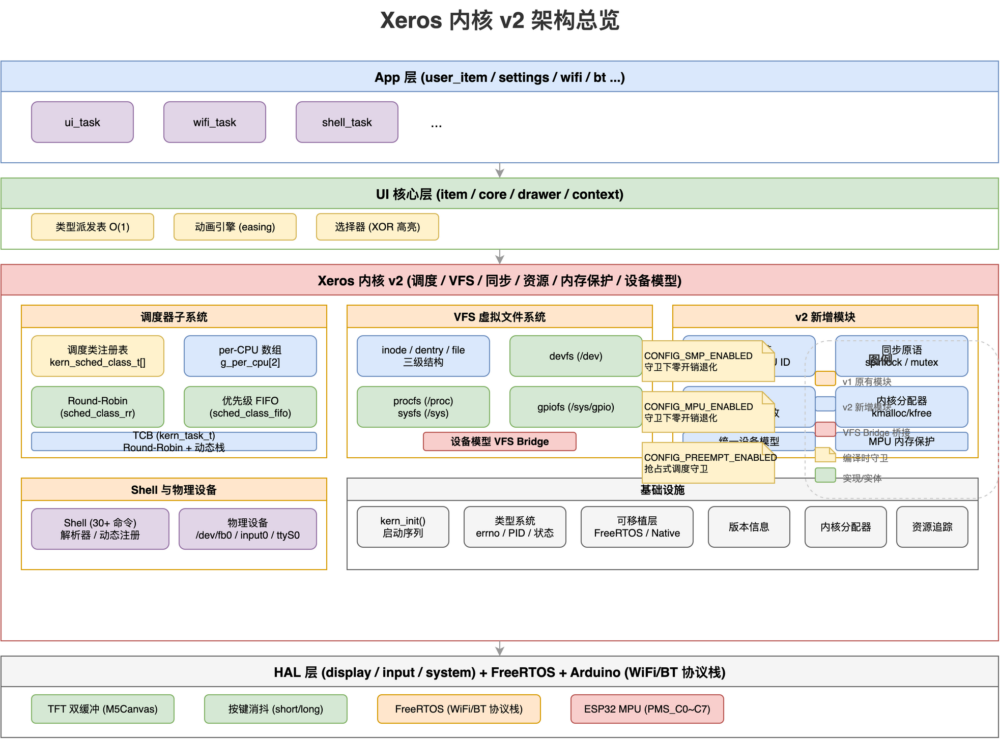
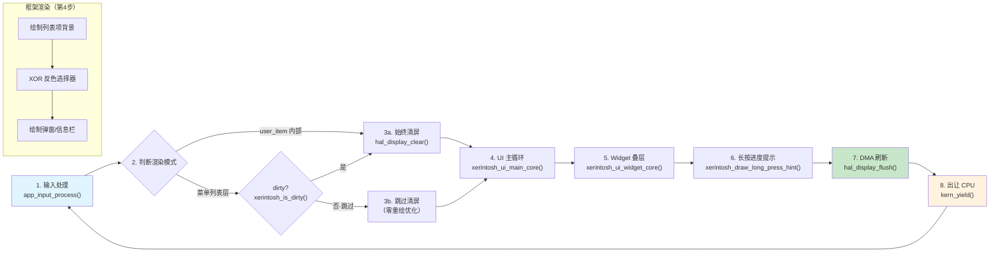

# Xerintosh UI for M5Stick-C 知识地图

## 架构总览

本项目是将 `reference/oled-ui-Xerintosh-lite`（128×64 OLED 菜单框架）移植到 **M5Stick-C**（80×160 TFT，ESP32-PICO）的固件项目。

采用 **四层架构**（v2 内核架构图: [PNG](assets/diagrams/kernel-v2-architecture.drawio)）：

```
Project Root
├── Xeros 内核层（v2 可插拔微内核: SMP + MPU + 设备模型）[总览](kernel/index.md)
│   ├── 核心子系统 (v1)
│   │   ├── [初始化与日志](kernel/kern-init.md)     ← 分级日志、panic、启动序列
│   │   ├── [类型系统](kernel/kern-types.md)        ← 错误码、常量、枚举
│   │   ├── [抢占式调度器](kernel/kern-task.md)     ← TCB、yield/sleep/exit/spawn
│   │   ├── [VFS 核心](kernel/kern-vfs.md)          ← inode/dentry/file + fd_table
│   │   ├── [设备文件系统](kernel/kern-devfs.md)    ← /dev/ 目录与设备注册
│   │   ├── [/proc 与 /sys](kernel/kern-procfs-sysfs.md) ← 内核状态与配置接口
│   │   ├── [GPIO 桥接](kernel/kern-gpiofs.md)      ← /sys/gpio 引脚状态映射
│   │   ├── [可移植层](kernel/kern-port.md)         ← FreeRTOS/Native 双后端
│   │   └── [Shell 命令行](kernel/kern-shell.md)    ← 30+ 命令交互式终端
│   ├── v2 新增子系统
│   │   ├── [SMP 多核支持](kernel/kern-smp.md)      ← per-CPU 数据, 零开销退化
│   │   ├── [同步原语](kernel/kern-sync.md)         ← spinlock + mutex
│   │   ├── [可插拔调度类](kernel/kern-sched-class.md) ← class 注册/优先级链
│   │   ├── [Round-Robin 类](kernel/kern-sched-rr.md)   ← 默认两遍扫描调度
│   │   ├── [优先级 FIFO 类](kernel/kern-sched-fifo.md) ← 抢占式优先级调度
│   │   ├── [资源追踪](kernel/kern-resource.md)     ← 链表自动回收内存/FD/锁
│   │   ├── [内核分配器](kernel/kern-kmalloc.md)     ← kmalloc/kfree 统一分配
│   │   ├── [MPU 内存保护](kernel/kern-mpu.md)      ← 栈守卫 + 区域隔离
│   │   ├── [设备驱动模型](kernel/kern-device-model.md) ← kern_device_ops_t + VFS bridge
│   │   └── [版本信息](kernel/kern-version.md)       ← 版本号与开发者管理
├── HAL 层（硬件抽象）
│   ├── [显示驱动](hal/display.md)      ← TFT 双缓冲 / Native 内存帧缓冲
│   ├── [屏幕尺寸](hal/screen.md)       ← 运行时屏幕尺寸查询
│   ├── [输入系统](hal/input.md)        ← 按键消抖 + 短按/长按/双击状态机
│   └── [系统时钟](hal/system.md)       ← tick 与延时
├── UI 核心层（纯 C）— 2026年6月重构
│   ├── [项目系统](ui/item.md)          ← 列表项、开关、滑条、按钮、用户页（基类/树/选择器）
│   ├── [核心引擎](ui/core.md)          ← 动画插值、生命周期管理、主循环调度
│   ├── [类型派发表](ui/dispatch.md)    ← 函数指针数组 O(1) 类型路由（替代内联 switch）
│   ├── [全局上下文](ui/context.md)     ← 单例状态容器、向后兼容宏、退场动画状态
│   ├── [绘制管线](ui/drawer.md)        ← 列表外观、选择器 XOR 高亮、弹窗与信息栏、图标
│   ├── [— 列表绘制](ui/draw-list.md)   ← 列表项背景、文字、滚动条、跑马灯
│   ├── [— 退场动画](ui/draw-anim.md)   ← 退场遮罩渲染（沙漏 + 扫描线）
│   ├── [— 弹窗与信息栏](ui/draw-widgets.md) ← pop-up 弹窗、info bar 信息栏渲染
│   ├── [— 图标渲染](ui/draw-icons.md)  ← XBM 位图图标绘制
│   ├── [行列表动画工具](ui/ui-anim-row.md) ← 可复用行列表动画（入场滑入+高亮过渡）
│   └── [脏矩形管理](ui/ui-dirty.md)    ← 统一 invalidate / is_dirty / clear_dirty API
├── App 层（每个 App 独立子目录）
│   ├── app_init.c/h        ← 入口封装（委托给 app_menu/app_input）
│   ├── app_menu.c/h        ← 菜单树构建
│   ├── app_input.c/h       ← 每帧输入路由与状态机调度
│   ├── app_state.c/h       ← 跨模块全局状态（g_wifi_on/g_bt_on）
│   ├── app_mem.c/h         ← App 层统一内存视图（保留水位 + 安全分配判断）
│   ├── ui_service.c/h      ← user_item 生命周期公共辅助 + 横屏切换 helper
│   ├── ui_task.c           ← UI 内核任务包装（输入→渲染→yield）
│   ├── boot/               ← 开机画面
│   ├── settings/           ← 亮度/动画/方向设置 + 旋转兼容转换
│   ├── storage/            ← NVS 持久化存储
│   ├── wifi/               ← WiFi 状态机（扫描/连接/密码输入）
│   ├── bluetooth/          ← 蓝牙管理器（Classic BT SPP）
│   ├── serial_input/       ← 串口 CLI 输入（WiFi 密码/蓝牙配对码）
│   ├── serial_monitor/     ← 串口监视器 App（缓冲区/状态机/界面）
│   ├── taskmgr/             ← 任务管理器 App（进程列表/终止/保护）
│   ├── about/              ← 关于页面（版本/Logo/开发者信息）
│   ├── token_usage/        ← Token 用量统计（DeepSeek API）
│   ├── flasher/            ← 烧录桥接器（USB↔UART STK500/ESP32 协议）
│   ├── shutdown/           ← 关机画面 + 电源键长按弹窗
│   └── svc_mgr_helper.c/h  ← 系统服务懒加载助手（BT enable/disable）
├── [编码风格规范](coding-style.md)     ← C OOP 命名、封装、继承规范
├── 教程
│   └── [从零开始创建 App](tutorials/your-first-app.md) ← 面向初学者的 App 开发教程
└── 入口
    ├── src/main.cpp                   ← M5Stick-C 实际入口
    └── src/native_main.cpp            ← GoogleTest 桌面测试入口
```

## 架构层次关系



### 系统总体架构

```mermaid
graph TB
    subgraph APP["🎨 App 层"]
        direction LR
        user_items["user_item Apps<br/>taskmgr · serial_monitor<br/>token_usage · flasher<br/>about · shutdown"]
        menu["菜单树<br/>app_menu.c"]
        inp["输入路由<br/>app_input.c"]
    end

    subgraph UI["🖼️ UI 核心层"]
        direction LR
        item["Item 系统<br/>ui_item.h"]
        dispatch["类型派发表<br/>ui_dispatch.c<br/>O(1) 路由"]
        core["核心引擎<br/>ui_core.c"]
        drawer["渲染管线<br/>ui_drawer.c"]
        dirty["脏矩形管理<br/>ui_dirty.c"]
    end

    subgraph KERNEL["⚙️ Xeros 内核 v2"]
        direction LR
        sched["可插拔调度类<br/>RR · FIFO"]
        vfs["VFS<br/>inode/dentry/file"]
        devfs["devfs · procfs<br/>sysfs · gpiofs"]
        shell["Shell<br/>30+ 命令"]
        devmodel["设备驱动模型<br/>kern_device_ops_t"]
    end

    subgraph HAL["🔌 HAL 层"]
        direction LR
        display["显示驱动<br/>TFT 双缓冲"]
        input_hal["输入系统<br/>按键 FSM"]
        sys["系统时钟<br/>tick / delay"]
        layout["屏幕布局<br/>hal_layout.h"]
    end

    subgraph RT["📡 运行时"]
        direction LR
        freertos["FreeRTOS<br/>WiFi · BT 协议栈"]
        arduino["Arduino<br/>M5Unified"]
    end

    APP --> UI
    UI -->|"动画·渲染·选择器"| KERNEL
    KERNEL -->|"open/read/write"| HAL
    HAL -->|"M5GFX · tick"| RT
```



### 系统启动流程

```mermaid
sequenceDiagram
    autonumber
    participant HW as 🔌 硬件上电
    participant Setup as Arduino setup()
    participant Loop as Arduino loop()
    participant Kernel as Xeros Kernel
    participant UI as Xerintosh UI

    Note over HW: 按下电源键

    HW->>Setup: boot
    Setup->>Setup: Serial.begin(115200)
    Setup->>Setup: M5.begin() · 初始化 TFT/IMU/PMU
    Setup->>Setup: storage_init() · NVS 挂载
    Setup->>Setup: settings_load_from_storage()
    Setup->>Setup: hal_display_init() · setColorDepth + createSprite
    Setup->>Setup: hal_input_init() · 按键 FSM 初始化
    Setup->>Setup: boot_screen_show() · Macintosh 128K 开机动画
    Setup->>UI: app_init_ui() · 构建菜单树
    Setup->>Setup: app_init_managers() · WiFi/BT 管理器
    Setup->>UI: xerintosh_init_core() · 选择器+相机绑定
    Note over Setup: g_in_xerintosh = true

    Setup-->>Loop: setup() 返回 · 看门狗已喂

    rect rgb(240, 248, 255)
        Note over Loop,Kernel: 第一帧延迟初始化
        Loop->>Kernel: deferred_kernel_init()
        Kernel->>Kernel: kern_init() · 日志系统
        Kernel->>Kernel: kern_vfs_init() · VFS 根节点
        Kernel->>Kernel: kern_devfs_init() · /dev 目录
        Kernel->>Kernel: kern_procfs_init() · /proc 虚拟文件
        Kernel->>Kernel: kern_sysfs_init() · /sys 配置接口
        Kernel->>Kernel: kern_gpiofs_init() · GPIO 引脚映射
        Kernel->>Kernel: kern_devices_init() · fb0 / input0 / ttyS0 / pwrkey
        Kernel->>Kernel: kern_shell_init() · 启动 Shell 任务
        Kernel->>Kernel: kern_spawn("ui", ...) · UI 渲染任务
        Kernel->>Kernel: kern_spawn("wifi-mgr", ...) · WiFi 管理任务
        Kernel->>Kernel: kern_spawn("bt-mgr", ...) · BT 管理任务
    end

    Loop->>UI: app_input_process() · 每帧按键处理
    Loop->>UI: xerintosh_ui_main_core() · 选择器+列表渲染
    Loop->>UI: xerintosh_ui_widget_core() · 弹窗+信息栏
    Loop->>Loop: hal_display_flush() · DMA pushSprite
    Loop->>Loop: kern_yield() · 出让 CPU
    Note over Loop: 循环至 60fps
```

FreeRTOS 继续在底层为 WiFi/BT 协议栈服务。SMP 模式下 Xeros 在每个 CPU 上创建 FreeRTOS 任务运行调度循环，与底层不冲突。

> **架构图表:** [内核 v2 架构图](assets/diagrams/kernel-v2-architecture.drawio) | [任务生命周期](assets/diagrams/task-lifecycle.drawio) | [VFS Bridge](assets/diagrams/vfs-bridge.drawio) | [SMP 架构](assets/diagrams/smp-architecture.drawio) | [资源追踪链](assets/diagrams/resource-tracking.drawio) | [kmalloc 布局](assets/diagrams/kmalloc-layout.drawio) | [调度类优先级链](assets/diagrams/sched-class-chain.drawio)

## 渲染管线（每帧顺序）



采用**脏矩形优化**，静态画面下跳过清屏（~2ms 节省）。目标 60fps。

## 关键技术点

- **TFT 双缓冲**：使用 `M5Canvas` 作为后台缓冲区，必须传入父显示对象 `new M5Canvas(&M5.Display)`
- **XOR 选择器高亮**：TFT 不支持 OLED 的 `draw_color(2)` 反色，改用像素级 `color ^ 0xFFFF`
- **C 风格面向对象**：基类 `xerintosh_list_item_t` 作为结构体第一个成员，派生类通过强制类型转换实现多态
- **动画插值公式**：`current += (target - current) / (100.0f - speed)`
- **抢占式微内核**：可插拔调度类 + 动态栈管理 + VFS"一切皆文件"

## 文档树

### 内核层
- **[内核子系统总览](kernel/index.md)** — v2 架构总览、模块导航
- **[初始化与日志](kernel/kern-init.md)** — 内核启动入口、分级日志、panic 处理
- **[类型系统](kernel/kern-types.md)** — 错误码、PID、任务状态、CPU 标识
- **[抢占式调度器](kernel/kern-task.md)** — TCB、yield/sleep/exit/spawn、虚任务
- **[SMP 多核支持](kernel/kern-smp.md)** — per-CPU 数组、宏零开销退化、多核启动
- **[同步原语](kernel/kern-sync.md)** — spinlock_t + mutex_t、原子操作、单核退化
- **[可插拔调度类](kernel/kern-sched-class.md)** — 调度类接口、注册与优先级链
- **[Round-Robin 调度](kernel/kern-sched-rr.md)** — 默认两遍扫描、时间片递减
- **[优先级 FIFO](kernel/kern-sched-fifo.md)** — 优先级排序入队、抢占触发
- **[VFS 虚拟文件系统](kernel/kern-vfs.md)** — inode/dentry/file 三级结构、fd_table
- **[设备文件系统](kernel/kern-devfs.md)** — /dev/ 设备注册（新旧 API 双轨）
- **[设备驱动模型](kernel/kern-device-model.md)** — kern_device_ops_t + VFS bridge 桥接
- **[/proc 与 /sys](kernel/kern-procfs-sysfs.md)** — 内核状态信息与系统配置
- **[GPIO 桥接](kernel/kern-gpiofs.md)** — /sys/gpio 引脚状态映射
- **[资源追踪](kernel/kern-resource.md)** — 链表自动回收内存/互斥锁/FD
- **[内核分配器](kernel/kern-kmalloc.md)** — kmalloc/kfree 统一分配 + 元数据头
- **[MPU 内存保护](kernel/kern-mpu.md)** — 区域配置/栈守卫/ESP32 PMS 编码
- **[可移植层](kernel/kern-port.md)** — FreeRTOS/Native 多后端调度原语
- **[内核 Shell](kernel/kern-shell.md)** — 串口交互式命令行（30+ 命令）
- **[Shell 命令实现](kernel/kern-shell-cmds.md)** — 30+ 内置命令与动态注册
- **[Shell 解析器](kernel/kern-shell-parser.md)** — 输入行解析（引号支持）
- **[物理设备驱动](kernel/kern-devices.md)** — /dev/fb0 / /dev/input0 / /dev/ttyS0
- **[版本信息](kernel/kern-version.md)** — 版本号与开发者信息管理

### App 层
- **[应用初始化](app/app-init.md)** — 入口封装，委托菜单构建、输入处理与管理器初始化
- **[菜单构建](app/app-menu.md)** — Xerintosh UI 菜单树构造
- **[输入处理](app/app-input.md)** — 按键映射与各状态机调度
- **[全局状态](app/app-state.md)** — 跨模块全局状态（`g_wifi_on`、`g_bt_on`）
- **[统一内存视图](app/app-mem.md)** — 包装内核内存统计，提供保留水位感知的安全分配判断
- **[UI 公共服务](app/ui-service.md)** — user_item 生命周期公共辅助
- **[设置管理](app/settings.md)** — 亮度/动画/方向/波特率配置与存储
- **[开机画面](app/boot.md)** — Macintosh 128K 风格开机动画
- **[关于页面](app/about.md)** — 版本/Logo/开发者信息
- **[存储模块](app/storage.md)** — NVS 持久化存储封装
- **[WiFi 管理器](app/wifi.md)** — WiFi 状态机（扫描/连接/密码输入）
- **[蓝牙管理器](app/bluetooth.md)** — Classic BT SPP 生命周期与 UART 服务
- **[串口输入](app/serial-input.md)** — 串口 CLI 输入（WiFi/蓝牙密码）
- **[任务管理器](app/taskmgr.md)** — 进程列表查看与安全终止（动画行列表 + 横屏 3 行）
- **[串口监视器](app/serial-monitor.md)** — 串口数据监视（入场滑入动画 + 按钮平滑过渡）
- **[UI 任务](app/ui-task.md)** — 内核任务包装的 UI 主循环
- **[Token Usage](app/token-usage.md)** — DeepSeek API Token 用量统计与空 key 保护
- **[烧录器](app/flasher.md)** — USB↔UART 有线烧录桥接器（STK500/ESP32 SLIP 协议）
- **[示波器](app/oscilloscope.md)** — ADC 波形采集与显示（时间/电压/触发参数可调）
- **[关机模块](app/shutdown.md)** — 关机画面 + 电源键长按弹窗
- **[服务管理助手](app/svc-mgr-helper.md)** — 系统服务懒加载助手（BT enable/disable）

### 入门教程
- **[从零开始创建 App](tutorials/your-first-app.md)** — 面向初学者的完整教程，手把手教你创建第一个 `user_item` App
- **[API 调用模板](tutorials/api-templates.md)** — 12 个可直接复制的 API 调用模板，涵盖 UI 组件、服务模块、HAL 层与常见陷阱

### HAL 层
- **[显示驱动](hal/display.md)** — TFT/Native 双实现、绘制原语、XOR 矩形、字体与文本
- **[屏幕尺寸](hal/screen.md)** — 运行时屏幕尺寸查询，解耦布局模块与显示驱动
- **[输入系统](hal/input.md)** — 按键状态机、消抖、事件派发
- **[系统时钟](hal/system.md)** — `millis()` 封装、`std::chrono` 桌面回退
- **[屏幕布局](hal/layout.md)** — 与屏幕尺寸无关的定位宏（边距/行高/对齐）

### UI 核心层
🛈 原 `draw-driver` 模块已在 UI 重构中移除，其 `oled_*` → `hal_*` 桥接功能已分散到各调用方
- **[项目系统](ui/item.md)** — 列表项类型层次、构造与挂载、选择器与相机、确认/回退
- **[核心引擎](ui/core.md)** — 动画系统、生命周期管理、主循环调度、渲染分支
- **[类型派发表](ui/dispatch.md)** — 函数指针数组 O(1) 类型路由（替代内联 switch）
- **[全局上下文](ui/context.md)** — 单例状态容器、向后兼容宏、退场动画状态迁移
- **[选择器](ui/selector.md)** — 高亮框、导航、安全移出、锚定重建
- **[相机/视口](ui/camera.md)** — 视图滚动偏移、选择器可见性保证
- **[控件数据模型](ui/widget.md)** — 信息栏与弹窗状态、生命周期 API
- **[基础类型](ui/types.md)** — 枚举、回调类型、动画常量、布局常量
- **[绘制管线](ui/drawer.md)** — 列表外观绘制、选择器渲染、弹窗与信息栏、退场动画、图标
- **[行列表动画工具](ui/ui-anim-row.md)** — 可复用行列表动画（入场滑入 + 高亮平滑过渡）

## 快速链接

- [主入口点](../src/main.cpp)
- [测试入口点](../src/native_main.cpp)
- [PlatformIO 配置](../platformio.ini)
- [编码风格规范](coding-style.md)
- [开发者指南](developer-guide.md)

## 重构历史

执行两次重构轮次，按 `doc/refactor/README.md` 记录的状态推进。

| 日期 | 轮次 | 分支 | 范围 | 报告 |
|------|------|------|------|------|
| 2026-06-15 | 第一轮 | `refactor/2026-06-15-kernel-ui` | 内核 O(1) enqueue + FD 池 + P0 ISR；UI dirty rect + XOR 批量 + 缓存 | [归档](refactor/04-archive.md) |
| 2026-06-15 | 第二轮 | 同上 | 内核 P1-11 + O(1) 插入 + resource 池 + 设备加固；App 包装层 + getter 统一 | [归档 v2](refactor/04-archive-v2.md) |
| 2026-06-16 | 第八轮 | `refactor/2026-06-16-app-transition-device-optimizations` | 内核设备优化（设备注册表加锁、`/dev/ttyS0`/`fb0`/`input0`、`/sys/gpio`）；UI/App 过渡动画已回滚 | [内核设备优化报告](refactor/02-refactor/kernel-device-optimizations.md) |
| 2026-06-19 | 第十二轮 | `refactor/2026-06-19-memory-schedule` | 内核内存分配与调度按需分配（FreeRTOS 栈单位修复、内存统计/压力、栈高水位/自动增长、App 统一内存视图） | [归档](refactor/04-archive-memory-schedule.md) |

### 两轮合计内核优化

- ✅ 调度器 O(1) enqueue（task_list_tail）
- ✅ FD 对象池（16 预分配，消除 kern_open malloc）
- ✅ P0 ISR 修复（硬件定时器仅设标志位）
- ✅ 任务插入 O(1)（g_task_list_tail 全局尾指针）
- ✅ 资源节点池（32 预分配，消除 resource_track malloc）
- ✅ 设备驱动 buf NULL 加固（5 驱动）
- ✅ 移除重复 typedef

### 两轮合计 App 优化

- ✅ taskmgr 包装层解耦内核 API
- ✅ settings getter/setter 统一访问模式

静态内存增加：~1KB（FD 池 448B + resource 池 512B + 尾指针 12B），
换取消除运行时堆分配和碎片风险。

### 第八轮内核设备优化（2026-06-16，回滚后保留）

- ✅ 设备注册表加锁与失败回滚（`kern_device.c`）
- ✅ `/dev/ttyS0` 临界区保护 + 统一 ring buffer + 显式初始化
- ✅ `/dev/fb0` 清屏颜色协议修复 + rotation/fill_rect 参数校验
- ✅ `/dev/input0` 小型事件环形队列，避免事件丢失
- ✅ `/sys/gpio` 临界区 + 方向缓存 + 引脚边界检查
- ✅ 新增 `hal_display_clear_color()` HAL 抽象
- ✅ 新增 Native 测试：`test_kernel_device.cpp` / `test_kernel_devices.cpp` / `test_kernel_gpiofs.cpp`

验证结果：`pio run -e m5stick-c` ✅（RAM 28.1%，Flash 88.9%）；`pio test -e native` ✅ 442 passed，1 skipped。

### 第十二轮内存-调度重构（2026-06-19）

目标：改进 Xeros 内核内存分配与任务调度机制，使任务栈/内存按当前实际需求自动分配，解决 WiFi/蓝牙因静态内存预留导致无法共存和服务错误的问题。

**内核层优化**

- ✅ FreeRTOS 栈单位语义修复：`xTaskCreatePinnedToCore` 按 `StackType_t` 字数接收栈，`task->stack_size` 统一为字节
- ✅ `kern_task_stack.c` 新增栈高水位 `stack_highwater`、`kern_task_stack_highwater()`、`kern_task_stack_recommend()`
- ✅ Native 后端支持栈自动增长 `kern_task_stack_grow()`；FreeRTOS 后端明确不支持动态增长，采用创建时按需预留
- ✅ `kern_kmalloc.c` 新增内存统计 `kern_kmem_stat_t`、`kern_kmem_get_stats()`、内存压力等级、保留内存接口
- ✅ `kern_sched.c` 每 500 ticks 检查栈压力，每 100 ticks 分发内存压力回调
- ✅ `kern_sched_class.h` 新增 `memory_pressure` vtable 回调；RR class 在高压下缩短时间片
- ✅ `kern_resource.c` 资源节点池扩至 `KERN_MAX_TASKS * 4`
- ✅ `/proc/meminfo`、`ps`、`free` 等 Shell 命令使用新统计 API

**App 层优化**

- ✅ 新增 `src/app/app_mem.c/h`：统一内存视图 `xeros_mem_get_stats()` / `xeros_mem_available_bytes()` / `xeros_mem_can_alloc()`
- ✅ WiFi/BT 管理器启用前改用 `xeros_mem_can_alloc()` 双内存守卫（总空闲 + 最大连续块）
- ✅ BT 初始化错误分类，内存不足时返回 `BT_MGR_ERR_NO_MEM` 并回写 `g_bt_on`
- ✅ WiFi 关闭后采用轮询等待堆恢复，替代固定 500ms delay
- ✅ `main.cpp` UI/WiFi/BT 任务栈按需初始化为 4096 字节

**验证结果**

- `pio run -e m5stick-c` ✅（RAM 27.2%，Flash 89.4%）
- `pio test -e native` ✅ 242/243 passed，1 errored（基线已有的 native `ucontext` 上下文切换 SIGTRAP，非本轮引入）

**待跟进**

- 真机验证 WiFi/BT 共存、栈高水位显示、`free` 命令输出
- 根因修复 native `swapcontext` 在 spawned task 退出时的崩溃（已在 `main` 基线存在）
