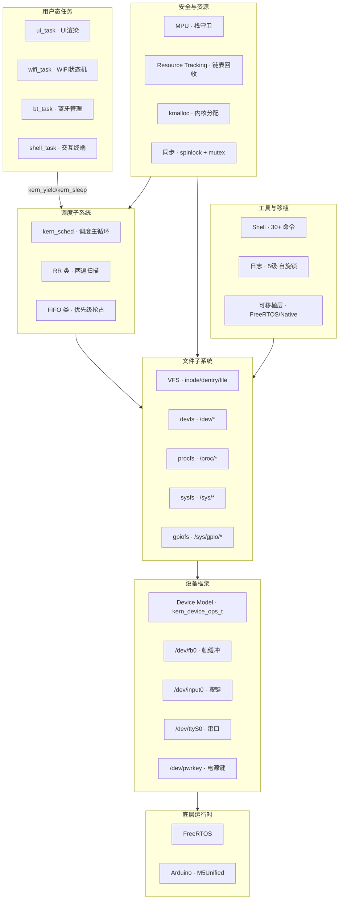

# Xeros 内核子系统总览

> **Parent:** [知识地图](../index.md) | **Related:** [类型系统](kern-types.md), [调度器](kern-task.md), [VFS](kern-vfs.md)

## 概述

Xeros 是一个轻量级**抢占式微内核**，运行在 M5Stick-C (ESP32-PICO, 520KB SRAM) 上。它的设计受到 Unix 哲学启发 — "一切皆文件"、进程隔离、系统调用接口 — 但为了嵌入式场景做了极简化。v2 新增了 **SMP 多核支持**、**MPU 内存保护**、**可插拔调度器类**、**资源追踪**和**统一设备驱动模型**。

核心设计目标：
1. **可插拔调度**：Round-Robin（默认）与优先级 FIFO（抢占优化）可并存，`CONFIG_PREEMPT_ENABLED` 编译时强制启用
2. **SMP 双核**：ESP32 PRO_CPU + APP_CPU 并行调度，per-CPU 数据隔离，`CONFIG_SMP_ENABLED` 守卫零开销退化至单核
3. **一切皆文件**：通过 VFS 将显示、按键、串口等硬件抽象为 `/dev/fb0`、`/dev/input0`、`/dev/ttyS0`
4. **资源安全**：任务退出时自动释放所有内核资源（内存分配、文件描述符、设备句柄）
5. **动态栈管理**：Native 后端中每个任务从 1KB 起始栈分配，上限 8KB，内置金丝雀（`0xDEADC0DE`）溢出检测；ESP32 FreeRTOS 后端栈由 FreeRTOS 自动管理

FreeRTOS 继续在底层为 WiFi/BT 协议栈服务，Xeros 运行在 Arduino `loop()` 的单一线程内（单核模式）或多 FreeRTOS 任务上（SMP 模式），不与底层冲突。

## Xeros 内核结构图



FreeRTOS 继续在底层为 WiFi/BT 协议栈服务。SMP 模式下 Xeros 在每个 CPU 上创建 FreeRTOS 任务运行调度循环，不与底层冲突。

## 模块导航

### 核心子系统

| 模块 | 文档 | 源码 | 核心职责 |
|------|------|------|----------|
| 类型系统 | [kern-types.md](kern-types.md) | `kern_types.h` | 错误码、PID、任务状态、日志级别、栈常量、CPU 标识 |
| 初始化与日志 | [kern-init.md](kern-init.md) | `kern_init.c/h` | 内核启动入口、分级日志、panic 处理 |
| 抢占式调度器 | [kern-task.md](kern-task.md) | `kern_task.c/h` | TCB、yield/sleep/exit/spawn、虚任务、动态栈 |
| 调度主循环 | — | `kern_sched.c/h` | 调度循环入口、tick 分发、上下文切换 |
| VFS 核心 | [kern-vfs.md](kern-vfs.md) | `kern_vfs.c/h` | inode/dentry/file 三级结构、路径解析、open/close/read/write |
| 设备文件系统 | [kern-devfs.md](kern-devfs.md) | `kern_devfs.c/h` | /dev/ 目录创建、设备注册 |
| /proc 与 /sys | [kern-procfs-sysfs.md](kern-procfs-sysfs.md) | `kern_procfs.c/h`, `kern_sysfs.c/h` | 内核状态信息、系统配置文件系统 |
| Shell | [kern-shell.md](kern-shell.md) | `kern_shell.c/h`, `kern_shell_cmds.c/h` | 串口交互式命令行（30+ 命令） |
| GPIO 桥接 | [kern-gpiofs.md](kern-gpiofs.md) | `kern_gpiofs.c/h` | /sys/gpio 引脚状态映射与读写 |
| 版本信息 | [kern-version.md](kern-version.md) | `kern_version.h` | 版本号与开发者信息集中管理 |
| 物理设备 | [kern-devices.md](kern-devices.md) | `devices/kern_devices.c` 等 | `/dev/fb0` 帧缓冲、`/dev/input0` 按键、`/dev/ttyS0` 串口 |
| — `/dev/fb0` | [dev-fb0.md](dev-fb0.md) | `devices/dev_fb0.c/h` | 帧缓冲设备（清屏/填充/旋转） |
| — `/dev/input0` | [dev-input0.md](dev-input0.md) | `devices/dev_input0.c/h` | 按键输入设备（事件环形队列） |
| — `/dev/ttyS0` | [dev-ttys0.md](dev-ttys0.md) | `devices/dev_ttyS0.cpp/h` | 串口 UART 设备（ring buffer + 临界区保护） |
| Shell 命令 | [kern-shell-cmds.md](kern-shell-cmds.md) | `kern_shell_cmds.c/h` | 30+ 内置命令实现与动态注册 |
| Shell 解析器 | [kern-shell-parser.md](kern-shell-parser.md) | `kern_shell_parser.c/h` | 输入行解析（引号支持、参数分割） |

### v2 新增子系统

| 模块 | 文档 | 源码 | 核心职责 |
|------|------|------|----------|
| SMP 支持 | [kern-smp.md](kern-smp.md) | `kern_smp.h/c` | per-CPU 数据结构、多核调度循环、零开销单核退化 |
| 同步原语 | [kern-sync.md](kern-sync.md) | `kern_sync.h/c` | spinlock_t（原子操作）、mutex_t（所有权检查）、单核退化 |
| 可插拔调度类 | [kern-sched-class.md](kern-sched-class.md) | `kern_sched_class.h/c` | 调度类接口、注册与遍历、pick_next_ready |
| Round-Robin 类 | [kern-sched-rr.md](kern-sched-rr.md) | `kern_sched_rr.h/c` | 两遍扫描、时间片递减、睡眠唤醒 |
| 优先级 FIFO 类 | [kern-sched-fifo.md](kern-sched-fifo.md) | `kern_sched_fifo.h/c` | 优先级排序、抢占触发、重排 |
| MPU 内存保护 | [kern-mpu.md](kern-mpu.md) | `kern_mpu.h/c` | 区域配置、栈守卫、上下文切换保护 |
| 资源追踪 | [kern-resource.md](kern-resource.md) | `kern_resource.h/c` | 资源链表、track/untrack/release_all |
| 内核分配器 | [kern-kmalloc.md](kern-kmalloc.md) | `kern_kmalloc.h/c` | kmalloc/kfree/kcalloc/krealloc |
| 设备驱动模型 | [kern-device-model.md](kern-device-model.md) | `kern_device.h/c` | 统一设备操作表 + VFS bridge |

## 关键设计决策

### 为什么用可插拔调度类？

在 520KB SRAM 的 ESP32 上：
- **抢占式时间片 + 优先级调度**：RR 默认公平轮转，FIFO 提供高优先级抢占响应
- **可插拔调度类**允许按需扩展调度策略，编译时注册即可
- 调度类按注册顺序决定优先级：RR 先注册（兜底），FIFO 后注册（高优先级优先）

### 为什么 per-CPU 宏能实现零开销？

`g_current_task` 等全局变量被 `kern_smp.h` 用宏替换：

```c
// 实际定义：g_per_cpu[0].current_task
// 宏展开：g_per_cpu[KERN_THIS_CPU].current_task
// 单核时：g_per_cpu[0].current_task（常数索引 → 编译器优化 = 直接内存访问）
```

当 `CONFIG_SMP_ENABLED` 未定义时，`KERN_THIS_CPU` 恒为 `0`，编译器将 `g_per_cpu[0]` 优化为与普通全局变量等价的直接地址访问。

### 为什么保留 FreeRTOS？

ESP32 Arduino 的 WiFi（`esp_wifi`）和蓝牙（Classic BT SPP）协议栈深度依赖 FreeRTOS。Xeros 不与 FreeRTOS 竞争——SMP 模式下，Xeros 在每个 CPU 上创建一个 FreeRTOS 任务运行调度循环，WiFi/BT 协议栈的 FreeRTOS 任务完全不受影响。

### 为什么 VFS 不实现全部 Linux 特性？

不实现 page cache、dentry LRU、块设备、inode 缓存。只保留核心抽象：`file_operations` 函数表（`read`/`write`/`ioctl`/`release`）。所有数据结构常驻内存，无磁盘对应的持久化需求。

## 初始化顺序

*📄 Source: [main.cpp](../../src/main.cpp#L138-L288)*

```
main.cpp setup():
    M5.begin()                    ← 硬件初始化
    storage_init()                ← NVS 存储
    settings_load_from_storage()  ← 恢复设置
    hal_display_init()            ← 显示驱动
    hal_input_init()              ← 按键驱动
    app_init_ui()                 ← UI 菜单树构造
    app_init_managers()           ← WiFi/BT 管理器初始化
    xerintosh_init_core()         ← Xerintosh UI 核心初始化

deferred_kernel_init()（loop() 第一帧触发）:
    kern_init()                   ← 内核日志系统
    kern_vfs_init()               ← VFS 根节点
    kern_devfs_init()             ← /dev 目录
    kern_procfs_init()            ← /proc 虚拟文件
    kern_sysfs_init()             ← /sys 虚拟文件
    kern_gpiofs_init()            ← /sys/gpio 引脚映射
    kern_devices_init()           ← 注册 fb0/input0/ttyS0
    kern_shell_init()             ← 启动 Shell 任务（内部调用 kern_spawn）
    kern_spawn("ui", ...)         ← UI 任务
    kern_spawn("wifi-mgr", ...)   ← WiFi 管理器任务
    kern_spawn("bt-mgr", ...)     ← BT 管理器任务
```

> **注意**：`kern_sched_init()` 不在 `main.cpp` 中显式调用，而是由首次 `kern_spawn()` 内部按需触发（见 [kern_task_lifecycle.c](../../src/kernel/kern_task_lifecycle.c#L167)）。`kern_port_init()` 同样由 `kern_sched_init()` 在 ESP32 FreeRTOS 后端中调用。

## 调度流程总览

```
kern_sched_tick() 每 tick:
    ├─ g_sched_ticks++              （per-CPU tick 计数递增）
    ├─ reap_zombies()               （回收僵尸任务资源）
    ├─ [PREEMPT 模式]
    │   ├─ 遍历所有 class->tick()   （RR 时间片递减，FIFO 抢占检测）
    │   ├─ if g_need_resched        （任一 class 标记了抢占）
    │   │   ├─ pick_next_ready()   （遍历 class 数组，先注册先查询）
    │   │   ├─ kern_mpu_apply()    （应用 MPU 区域）
    │   │   └─ 上下文切换
    │   └─ return
    └─ 正常调度
        ├─ pick_next_ready()
        ├─ kern_mpu_apply()
        └─ 上下文切换
```

## 文件系统布局（v2）

```
/                         ← VFS 根目录
├── dev/
│   ├── fb0               ← 帧缓冲
│   ├── input0            ← 按键事件
│   ├── ttyS0             ← 串口
│   └── pwrkey            ← 电源键事件（v2 新设备模型）
├── proc/
│   ├── tasks             ← 任务列表（含 cpu_id/scheduler_class）
│   ├── uptime            ← 内核运行时间
│   ├── version           ← 内核版本号
│   ├── meminfo           ← 堆内存统计
│   └── developer         ← 开发者信息
├── sys/
│   ├── brightness        ← 亮度（0-255）
│   ├── rotation          ← 屏幕方向（0-3）
│   ├── anim_speed        ← 动画速度（0-100）
│   ├── anim_enabled      ← 动画开关（0/1）
│   ├── kernel/
│   │   └── log_level     ← 日志级别（0-3）
│   └── gpio/
│       ├── list          ← 所有引脚状态汇总
│       └── 0..37         ← 各引脚状态
└── tmp/                  ← 临时目录
```

---

> **See Also:** [类型系统](kern-types.md) | [调度器](kern-task.md) | [SMP 支持](kern-smp.md) | [可插拔调度类](kern-sched-class.md) | [VFS 核心](kern-vfs.md) | [设备驱动模型](kern-device-model.md) | [架构计划](../../.claude/plans/microkernel.plan.md)
