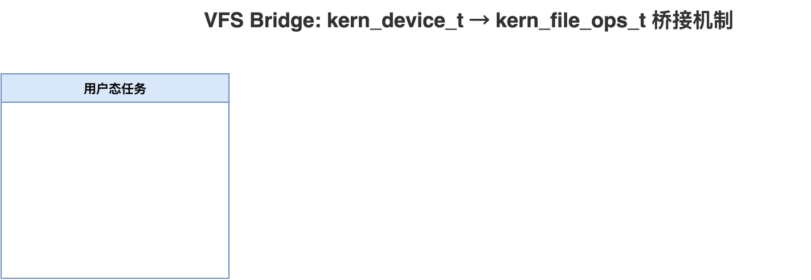
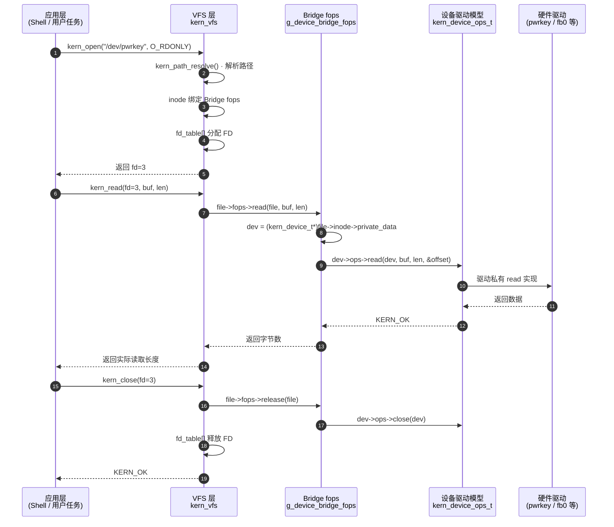

# 统一设备驱动模型

> **Parent:** [内核总览](index.md) | **Related:** [VFS 核心](kern-vfs.md), [设备文件系统](kern-devfs.md), [物理设备](kern-devices.md)

## 概述

v2 引入了**统一设备驱动模型**（`kern_device_t`），为所有硬件驱动提供标准化的操作接口和注册机制。核心思想是将设备驱动的操作签名从 VFS 的 `kern_file_ops_t` 解耦出来，形成独立的 `kern_device_ops_t`，再通过**VFS 桥接层**将两者连接。



### VFS 与设备桥接流程



---

## 关键概念

### 设备描述符：kern_device_t

*📄 Source: [kern_device.h](../../src/kernel/kern_device.h#L50-L56)*

```c
struct kern_device {
    char                   name[KERN_NAME_MAX + 1];  /* 设备名称（如 "pwrkey"） */
    kern_device_type_t     type;                      /* KERN_DEV_CHAR 或 KERN_DEV_BLOCK */
    kern_device_ops_t     *ops;                       /* 操作函数表 */
    void                  *private_data;              /* 驱动私有数据（如 DMA 缓冲区） */
    struct kern_device    *next;                      /* 全局链表下一节点 */
};
```

每个物理或虚拟设备创建一个 `kern_device_t` 实例。`name` 用于在全局链表中的查找，`ops` 指向设备自己的操作实现，`private_data` 可存储任意驱动特定状态（如缓冲区指针、硬件寄存器基址），`next` 构成全局单链表。

### 设备操作表：kern_device_ops_t

*📄 Source: [kern_device.h](../../src/kernel/kern_device.h#L36-L42)*

```c
typedef struct kern_device_ops {
    kern_err_t  (*open)(kern_device_t *dev, int flags);
    kern_err_t  (*close)(kern_device_t *dev);
    kern_err_t  (*read)(kern_device_t *dev, void *buf, size_t len, size_t *offset);
    kern_err_t  (*write)(kern_device_t *dev, const void *buf, size_t len, size_t *offset);
    kern_err_t  (*ioctl)(kern_device_t *dev, unsigned int cmd, unsigned long arg);
} kern_device_ops_t;
```

**与 `kern_file_ops_t` 的关键差异**：

| 维度 | `kern_file_ops_t`（VFS 签名） | `kern_device_ops_t`（设备签名） |
|------|------------------------------|-------------------------------|
| 第一参数 | `kern_file_t *f` | `kern_device_t *dev` |
| 关闭回调名 | `release` | `close` |
| read/write 偏移量 | 通过 `f->f_pos` 隐式传递 | 通过 `size_t *offset` 显式传递 |
| 返回类型 | `int` / `ssize_t` | `kern_err_t` |
| 关注点 | VFS 文件系统语义 | 设备硬件操作语义 |

这种解耦使设备驱动无需了解 VFS 内部结构（如 `kern_file_t` 的布局），只需关注设备本身。

---

## 全局设备链表（注册表）

### 数据结构

*📄 Source: [kern_device.c](../../src/kernel/kern_device.c#L21)*

```c
static kern_device_t *g_device_list = NULL;   /* 单链表头指针 */
```

所有通过 `kern_device_register()` 注册的设备被加入此链表。链表采用**头插法**（新设备插入链表头部），O(1) 插入，O(n) 查找。

### 注册表初始化

*📄 Source: [kern_device.c](../../src/kernel/kern_device.c#L21-L34) 与 [kern_device.h](../../src/kernel/kern_device.h#L79-L91)*

```c
static kern_device_t *g_device_list = NULL;
static mutex_t        g_device_list_mutex;
static bool           g_device_list_initialized = false;

void kern_device_init(void)
{
    if (g_device_list_initialized) {
        return;
    }
    mutex_init(&g_device_list_mutex);
    g_device_list_initialized = true;
}
```

`kern_device_init()` 初始化全局设备注册表的互斥锁。该函数是幂等的，通常在 `kern_devices_init()` 中先于任何 `kern_device_register()` 调用。

### 注册与查找

*📄 Source: [kern_device.c](../../src/kernel/kern_device.c#L38-L164)*

```c
kern_err_t kern_device_register(kern_device_t *dev)
{
    if (dev == NULL) {
        return KERN_EINVAL;
    }
    if (dev->name[0] == '\0') {
        return KERN_EINVAL;
    }

    mutex_lock(&g_device_list_mutex);

    /* 检查同名设备是否已注册 */
    kern_device_t *existing = NULL;
    kern_device_t *cur = g_device_list;
    while (cur != NULL) {
        if (strcmp(cur->name, dev->name) == 0) {
            existing = cur;
            break;
        }
        cur = cur->next;
    }
    if (existing != NULL) {
        mutex_unlock(&g_device_list_mutex);
        if (existing == dev) {
            return KERN_OK;  /* 同一指针幂等 */
        }
        return KERN_EEXIST;
    }

    /* 前插到链表头部 */
    dev->next = g_device_list;
    g_device_list = dev;

    /* 创建 /dev/<name> 节点 */
    char path[KERN_PATH_MAX];
    int written = snprintf(path, sizeof(path), "/dev/%s", dev->name);
    if (written < 0 || (size_t)written >= sizeof(path)) {
        g_device_list = dev->next;
        dev->next = NULL;
        mutex_unlock(&g_device_list_mutex);
        return KERN_ENOSPC;
    }

    kern_inode_t *inode = (kern_inode_t *)calloc(1, sizeof(kern_inode_t));
    if (inode == NULL) {
        g_device_list = dev->next;
        dev->next = NULL;
        mutex_unlock(&g_device_list_mutex);
        return KERN_ENOMEM;
    }

    inode->type = KERN_FILE_CHRDEV;
    inode->fops = kern_device_create_fops(dev);
    inode->private_data = dev;

    kern_err_t rc = kern_dentry_register(path, inode);
    if (rc != KERN_OK) {
        free(inode);
        g_device_list = dev->next;
        dev->next = NULL;
        mutex_unlock(&g_device_list_mutex);
        return rc;
    }

    mutex_unlock(&g_device_list_mutex);
    kern_log(KERN_LOG_INFO, "device registered: %s", path);
    return KERN_OK;
}
```

`kern_device_register()` 现在是一个**原子化的注册 + VFS 挂载**操作：

1. 参数校验（`dev` 非空、名称非空）。
2. 加互斥锁 `g_device_list_mutex`，防止并发注册/反注册。
3. 去重检查：同名且不同指针返回 `KERN_EEXIST`；同一指针再次注册返回 `KERN_OK`。
4. 头插法加入全局设备链表。
5. 自动构建 `/dev/<name>` 路径，分配 inode 并绑定 bridge fops 与 `private_data`。
6. 调用 `kern_dentry_register()` 挂入 VFS。
7. 第 4–6 步中任意失败都会**回滚**链表头插操作，并释放已分配资源。

*📄 Source: [kern_device.c](../../src/kernel/kern_device.c#L108-L126)*

`kern_device_find()` 在互斥锁保护下遍历 `g_device_list`，按名称 `strcmp` 匹配，返回对应设备指针；未找到返回 `NULL`。

*📄 Source: [kern_device.c](../../src/kernel/kern_device.c#L128-L164)*

`kern_device_unregister()` 从注册表中移除设备，并同步删除对应的 `/dev/<name>` 节点。调用者应确保此时没有打开的 FD，否则 VFS 节点移除后已打开的 FD 仍可继续工作（通过 inode 引用计数），但新 `kern_open()` 会失败。

#### 中文伪代码拆解

```
函数 注册设备(设备描述符) {
    if (设备描述符为空 或 设备名为空) return 参数错误

    加锁(设备链表互斥锁)

    if (同名设备已存在) {
        解锁()
        if (找到的就是当前设备) return 成功   // 幂等
        return 已存在错误
    }

    设备描述符.下一个 = 全局链表头           // 头插法
    全局链表头 = 设备描述符

    路径 = "/dev/" + 设备名
    if (路径过长) {
        撤销头插，恢复链表                  // 回滚
        解锁()
        return 路径空间不足
    }

    inode = 分配零化的 inode 结构
    if (分配失败) {
        撤销头插                           // 回滚
        解锁()
        return 内存不足
    }

    inode.类型 = 字符设备
    inode.操作表 = 创建设备桥接 fops(设备)
    inode.私有数据 = 设备描述符            // 桥接关键

    结果 = VFS注册路径(路径, inode)
    if (结果 != 成功) {
        释放 inode
        撤销头插                           // 回滚
        解锁()
        return 结果
    }

    解锁()
    记录日志("设备已注册: 路径")
    return 成功
}

/* 查找与反注册逻辑较简单：前者遍历链表按名匹配，后者移除节点后删除 /dev/<name> */
```

---

## VFS 桥接层（Bridge）

### 桥接原理

`kern_device_ops_t` 和 `kern_file_ops_t` 签名不同，需要翻译层。Xeros 使用一个**全局共享的单例 bridge fops**（`g_device_bridge_fops`）完成翻译：每个 bridge 函数先通过 `file_to_dev(f)` 从 `f->inode->private_data` 取出 `kern_device_t*`，再调用设备自己的 `ops` 回调。

### file_to_dev() —— 提取设备指针

*📄 Source: [kern_device.c](../../src/kernel/kern_device.c#L177-L183)*

```c
static kern_device_t *file_to_dev(kern_file_t *f)
{
    if (f == NULL || f->inode == NULL) return NULL;
    return (kern_device_t *)f->inode->private_data;
}
```

这是桥接层的核心：从 `kern_file_t` 一路追溯到 `inode->private_data`，提取出设备指针。此函数在每一个 bridge 函数中被首先调用。

### 五个 bridge 函数

*📄 Source: [kern_device.c](../../src/kernel/kern_device.c#L185-L230)*

| Bridge 函数 | 翻译逻辑 | 空指针安全 |
|------------|---------|-----------|
| `bridge_open(f, flags)` | `dev->ops->open(dev, flags)` | ops 或 open 为 NULL → 返回 KERN_OK |
| `bridge_read(f, buf, len)` | `dev->ops->read(dev, buf, len, &f->f_pos)` | ops 或 read 为 NULL → 返回 KERN_EINVAL |
| `bridge_write(f, buf, len)` | `dev->ops->write(dev, buf, len, &f->f_pos)` | ops 或 write 为 NULL → 返回 KERN_EINVAL |
| `bridge_ioctl(f, cmd, arg)` | `dev->ops->ioctl(dev, cmd, arg)` | ops 或 ioctl 为 NULL → 返回 KERN_ENOTTY |
| `bridge_release(f)` | `dev->ops->close(dev)` | ops 或 close 为 NULL → 返回 KERN_OK |

**关键细节**：`bridge_read` 和 `bridge_write` 将 `f->f_pos` 的地址传给设备的 `read/write`，设备可在内部更新偏移量。`bridge_open` 和 `bridge_release` 对缺失的回调是宽容的（返回 OK），因为很多简单设备不需要打开/关闭逻辑。

### 共享 bridge fops 单例

*📄 Source: [kern_device.c](../../src/kernel/kern_device.c#L239-L251)*

```c
static kern_file_ops_t g_device_bridge_fops = {
    .open    = bridge_open,
    .read    = bridge_read,
    .write   = bridge_write,
    .ioctl   = bridge_ioctl,
    .release = bridge_release,
};

kern_file_ops_t *kern_device_create_fops(kern_device_t *dev)
{
    (void)dev;
    return &g_device_bridge_fops;   /* 所有设备返回同一个实例 */
}
```

**单例设计的意义**：
- 内存效率：无论注册多少个设备，只需一份 bridge 函数表
- 路由解耦：函数表本身不绑定设备，设备指针通过运行时 `inode->private_data` 获取
- 即插即用：新设备只需实现 `kern_device_ops_t`，调用 `kern_device_register()` 即完成 VFS 集成

---

## 迁移示例：dev_pwrkey.c

`/dev/pwrkey`（电源键设备）是首个从旧版 API 迁移到统一设备模型的设备，作为概念验证。

*📄 Source: [dev_pwrkey.c](../../src/kernel/devices/dev_pwrkey.c#L88-L94)*

### 新版方式（实际实现）

```c
// 新版：实现 kern_device_ops_t（设备语义）
static kern_device_ops_t g_pwrkey_ops = {
    .open  = pwrkey_open,     // 签名: kern_err_t (*)(kern_device_t*, int)
    .close = pwrkey_close,    // 签名: kern_err_t (*)(kern_device_t*)
    .read  = pwrkey_read,     // 签名: kern_err_t (*)(kern_device_t*, void*, size_t, size_t*)
    .write = pwrkey_write,    // 只需关注设备本身，无需了解 VFS
    .ioctl = pwrkey_ioctl,
};

kern_device_t g_pwrkey_dev = {
    .name         = "pwrkey",
    .type         = KERN_DEV_CHAR,
    .ops          = &g_pwrkey_ops,
    .private_data = NULL,
    .next         = NULL,
};

// 在 kern_devices_init() 中一行注册：
kern_device_register(&g_pwrkey_dev);
```

### 设备操作实现

*📄 Source: [dev_pwrkey.c](../../src/kernel/devices/dev_pwrkey.c#L31-L57)*

```c
static kern_err_t pwrkey_read(kern_device_t *dev, void *buf, size_t len, size_t *offset)
{
    if (len < DEV_PWRKEY_EVENT_SIZE) return KERN_EINVAL;

    dev_pwrkey_event_t ev;
    memset(&ev, 0, sizeof(ev));

    hal_pwr_key_event_t e = hal_power_key_get_event();
    if (e != HAL_PWR_KEY_NONE) {
        ev.event     = (uint8_t)e;
        ev.hold_ms   = hal_power_key_get_hold_duration_ms();
        ev.timestamp = hal_get_ticks();
    }

    memcpy(buf, &ev, DEV_PWRKEY_EVENT_SIZE);
    return DEV_PWRKEY_EVENT_SIZE;
}
```

设备只需关注硬件操作——轮询按键硬件、填充事件结构体、拷贝到用户缓冲区。VFS 的 FD 管理、权限检查、路径解析全部由桥接层和 VFS 透明处理。

---

## 与其他组件的关系

- **kern_vfs**：定义 `kern_file_ops_t`，桥接层的"另一侧"；新设备通过 bridge 使用 VFS
- **kern_devfs**：`kern_devfs_init()` 仅负责创建 `/dev` 目录；`kern_device_register()` 内部完成设备注册 + VFS dentry 创建
- **物理设备层**：`kern_devices_init()` 中调用 `kern_device_register()` 注册新模型设备
- **kern_resource**：VFS 层 `kern_open()` 自动追踪 FD，设备驱动无需关心资源管理
- **HAL 层**：设备驱动通过 `hal_*` API 访问硬件（如 `hal_power_key_get_event()`）

> **See Also:** [VFS 核心](kern-vfs.md) | [设备文件系统](kern-devfs.md) | [物理设备](kern-devices.md) | [GPIO 桥接](kern-gpiofs.md)
