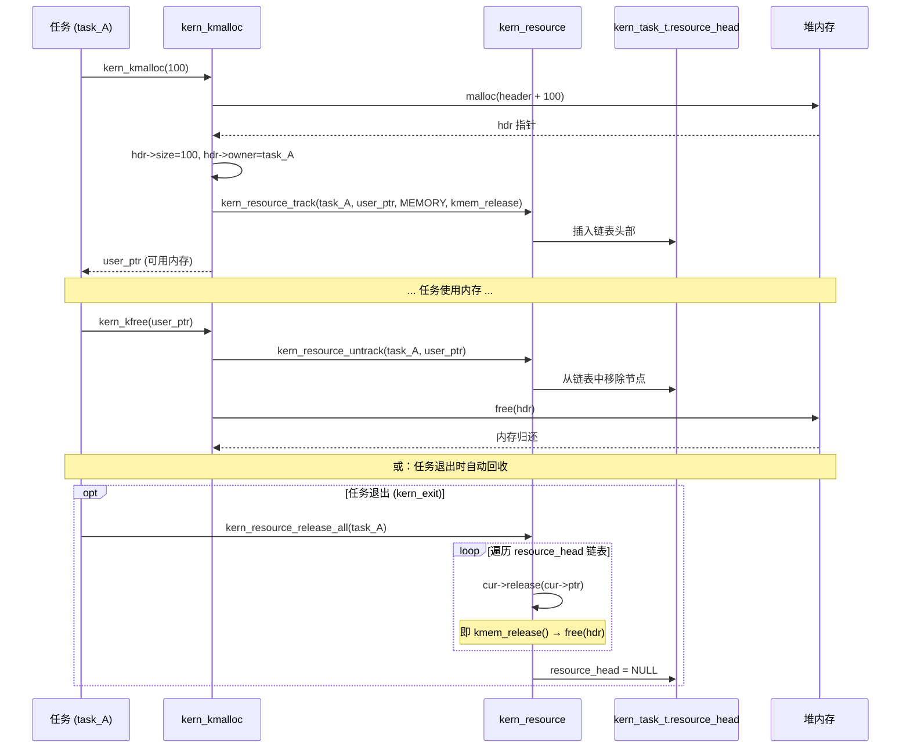

# 内核统一分配器（Kern Kmalloc）

> **Parent:** [内核总览](index.md) | **Related:** [资源追踪](kern-resource.md), [调度器](kern-task.md), [类型系统](kern-types.md)

## 概述

`kern_kmalloc` 是 Xeros 内核的**统一内存分配器**，是内核中所有动态内存分配的**唯一合法入口**。它包装标准 `malloc/free`，通过在每个分配块前嵌入元数据头来完成两件事：**记录分配大小和所有权**，并**自动将分配关联到当前任务的资源追踪系统**。

设计动机：如果开发者在内核代码中直接使用 `malloc`，任务退出时这些内存块将无法被自动回收。统一分配器通过 `kern_resource_track` 将每次分配注册到任务控制块，使 `kern_exit()` 时能够自动 `free` 所有未释放的内存。

---

## 关键概念

### 内存布局：元数据头嵌入

*📄 Source: [kern_kmalloc.c](../../src/kernel/kern_kmalloc.c#L25-L37)*

```c
typedef struct {
    size_t size;         /* 用户请求的分配大小（不含头） */
    kern_task_t *owner;  /* 拥有此分配的任务 */
} kmalloc_header_t;

static inline kmalloc_header_t *get_header(void *ptr)
{
    if (ptr == NULL) return NULL;
    return (kmalloc_header_t *)((uint8_t *)ptr - sizeof(kmalloc_header_t));
}
```

**关键设计**：`kmalloc_header_t` 存储在返回给用户的指针**之前**。用户看到的指针 = 头地址 + `sizeof(kmalloc_header_t)`。这意味着调用者完全不知道元数据的存在，但分配器可以通过 `get_header()` 反向定位到元数据。

### 内存布局图示

```
                         kern_kmalloc(100) 返回的指针
                                   │
                                   ▼
┌──────────────────┬──────────────────────────────────────┐
│ kmalloc_header_t │         用户数据区 (100 字节)         │
│                  │                                      │
│ .size  = 100     │  ← 用户可读写                        │
│ .owner = task_A  │                                      │
└──────────────────┴──────────────────────────────────────┘
        ▲
        │
   实际 malloc() 返回的指针
   (sizeof(header) + 100 字节)
```

### 释放回调：kmem_release

*📄 Source: [kern_kmalloc.c](../../src/kernel/kern_kmalloc.c#L41-L46)*

```c
static void kmem_release(void *ptr)
{
    if (ptr == NULL) return;
    kmalloc_header_t *hdr = get_header(ptr);
    free(hdr);  /* 释放整块内存（头+数据） */
}
```

这个回调被注册到资源追踪系统中。当 `kern_resource_release_all()` 遍历资源链表时，对每个 `KERN_RES_MEMORY` 类型的节点调用此函数。它从用户指针反推头地址，然后一次 `free(hdr)` 释放整块内存。

---

## API 详解

### kern_kmalloc — 分配内存

*📄 Source: [kern_kmalloc.c](../../src/kernel/kern_kmalloc.c#L83-L86)（包装层）/ [L51-L79](../../src/kernel/kern_kmalloc.c#L51-L79)（内部实现 `kern_kmalloc_impl`）*

```c
/* 公共 API — 薄包装层 */
void *kern_kmalloc(size_t size)
{
    return kern_kmalloc_impl(size, kern_task_current(), true);
}

/* 内部实现 — 所有分配变体共用 */
static void *kern_kmalloc_impl(size_t size, kern_task_t *owner, bool track)
{
    if (size == 0) return NULL;

    /* 防止溢出 */
    size_t total = sizeof(kmalloc_header_t) + size;
    if (total < size) return NULL;  /* 溢出检查 */

    kmalloc_header_t *hdr = (kmalloc_header_t *)malloc(total);
    if (hdr == NULL) return NULL;

    hdr->size = size;
    hdr->owner = owner;

    void *user_ptr = (void *)((uint8_t *)hdr + sizeof(kmalloc_header_t));

    if (track) {
        /* 追踪到当前任务 */
        int ret = kern_resource_track(owner, user_ptr,
                                      KERN_RES_MEMORY, kmem_release);
        if (ret != KERN_OK) {
            /* 追踪失败，释放分配（兼容性保护） */
            free(hdr);
            return NULL;
        }
    }

    return user_ptr;
}
```

`kern_kmalloc()` 是薄包装层，固定传入 `kern_task_current()` 作为 owner 并启用追踪。`kern_kmalloc_impl()` 是所有分配变体（`kern_kmalloc`、`kern_kmalloc_for_task`、`kern_kmalloc_untracked`）的共享实现。

#### 中文伪代码拆解

```
函数 内核分配(请求大小) {
    if (请求大小 == 0) return NULL

    总大小 = 元数据头大小 + 请求大小
    if (总大小 溢出) return NULL   // 防止 size_t 回绕

    头指针 = malloc(总大小)
    if (头指针 == NULL) return NULL  // 堆内存耗尽

    头指针.大小 = 请求大小
    头指针.所有者 = 获取当前任务()

    用户指针 = 头指针 + 头大小     // 向前偏移，露出用户区

    /* 关键步骤：注册到资源追踪 */
    结果 = 追踪资源(头指针.所有者, 用户指针, MEMORY类型, kmem_release回调)
    if (结果 != 成功) {
        free(头指针)                // 追踪失败，回滚
        return NULL
    }

    return 用户指针
}
```

**核心思想**：三步走——底层分配 → 写元数据 → 追踪到任务。任何一步失败都回滚，保证原子性（要么成功返回可用指针，要么返回 NULL 且无副作用）。

### kern_kcalloc — 分配清零

*📄 Source: [kern_kmalloc.c](../../src/kernel/kern_kmalloc.c#L99-L112)*

```c
void *kern_kcalloc(size_t nmemb, size_t size)
{
    size_t total;
    if (nmemb > 0 && size > (size_t)(-1) / nmemb) return NULL;  /* 溢出检查 */
    total = nmemb * size;
    if (total == 0) return NULL;

    void *ptr = kern_kmalloc(total);
    if (ptr != NULL) memset(ptr, 0, total);
    return ptr;
}
```

先调用 `kern_kmalloc` 走完整的分配+追踪流程，然后 `memset` 清零后返回。多了一层溢出检查（`nmemb * size` 是否溢出 `size_t` 最大值）。

### kern_kfree — 释放内存

*📄 Source: [kern_kmalloc.c](../../src/kernel/kern_kmalloc.c#L114-L127)*

```c
void kern_kfree(void *ptr)
{
    if (ptr == NULL) return;

    kmalloc_header_t *hdr = get_header(ptr);
    if (hdr == NULL) return;

    /* 从资源追踪中移除 */
    if (hdr->owner != NULL) {
        kern_resource_untrack(hdr->owner, ptr);
    }

    free(hdr);
}
```

#### 中文伪代码拆解

```
函数 内核释放(用户指针) {
    if (用户指针 == NULL) return    // 兼容 free(NULL)

    头指针 = 获取头部(用户指针)
    if (头指针 == NULL) return      // 安全保护

    /* 步骤一：从追踪链表中移除（防止 release_all 时重复释放） */
    if (头指针.所有者 != NULL)
        取消追踪(头指针.所有者, 用户指针)

    /* 步骤二：释放整块内存 */
    free(头指针)
}
```

**为什么先 untrack 再 free？** 顺序很重要。如果先 free 再 untrack，释放后的内存可能被重分配覆盖，导致 `kern_resource_untrack()` 中的链表遍历读取到脏数据。先 untrack 保证链表遍历总是访问有效内存。

### kern_krealloc — 重新分配

*📄 Source: [kern_kmalloc.c](../../src/kernel/kern_kmalloc.c#L139-L185)*

这是最复杂的 API。`krealloc` 需要在「取消旧追踪 → 调用标准 realloc → 重新追踪」三条路径中正确处理失败场景。

```
kern_krealloc(ptr, new_size)
        │
        ├── ptr == NULL ─────────→ kern_kmalloc(new_size)   [行为同 malloc]
        │
        ├── new_size == 0 ───────→ kern_kfree(ptr)          [行为同 free]
        │                              return NULL
        │
        └── 正常路径:
               │
               ├── 1. get_header(ptr) → old_hdr
               │
               ├── 2. kern_resource_untrack(old_hdr->owner, ptr)
               │       （从旧任务追踪中移除）
               │
               ├── 3. new_hdr = realloc(old_hdr, header_size + new_size)
               │       │
               │       ├── 成功: 继续
               │       └── 失败: 重新追踪旧内存（恢复状态）
               │                 kern_resource_track(old_hdr->owner, ptr, ...)
               │                 return NULL
               │
               ├── 4. 更新 new_hdr->size, new_hdr->owner
               │
               └── 5. 追踪到新任务（可能与旧任务不同）
                       kern_resource_track(new_hdr->owner, user_ptr, ...)
```

**关键安全设计**：当 `realloc()` 失败时，旧内存块仍然有效。代码会**重新追踪**旧块的 `(owner, ptr)` 关系到资源追踪系统，确保不会因为 untrack 后就丢失了追踪信息。这保证了失败路径下的状态一致性。

### kern_kmalloc_for_task — 为指定任务分配并追踪

*📄 Source: [kern_kmalloc.c](../../src/kernel/kern_kmalloc.c#L88-L92)*

```c
void *kern_kmalloc_for_task(kern_task_t *task, size_t size)
{
    if (task == NULL) return NULL;
    return kern_kmalloc_impl(size, task, true);
}
```

与 `kern_kmalloc()` 的区别在于：分配块的 `owner` 字段被设为传入的 `task`，而不是当前任务。典型用途是在**目标任务尚未开始运行前**就为其分配栈内存，使栈能被目标任务的资源链表正确追踪。

*📄 调用点: [kern_task_stack.c](../../src/kernel/kern_task_stack.c#L28)*

```c
task->stack_base = (uint8_t *)kern_kmalloc_for_task(task, stack_size);
```

### kern_kmalloc_untracked / kern_kfree_untracked — 不进入资源追踪

*📄 Source: [kern_kmalloc.c](../../src/kernel/kern_kmalloc.c#L94-L97) / [L129-L137](../../src/kernel/kern_kmalloc.c#L129-L137)*

```c
void *kern_kmalloc_untracked(size_t size)
{
    return kern_kmalloc_impl(size, NULL, false);
}

void kern_kfree_untracked(void *ptr)
{
    if (ptr == NULL) return;

    kmalloc_header_t *hdr = get_header(ptr);
    if (hdr == NULL) return;

    free(hdr);
}
```

`untracked` 分配块仍然带有 `kmalloc_header_t`（便于与标准 `free` 兼容），但 `owner = NULL` 且**不进入任何任务的资源追踪链表**。适用场景：

| 场景 | 原因 |
|------|------|
| 资源追踪节点自身 | `kern_resource_t` 若用 `kern_kmalloc()` 分配，会形成"追踪节点追踪自己"的递归依赖 |
| 全局/静态生命周期对象 | 对象生命周期不绑定任何任务 |
| 内核启动早期 | 当前任务尚未建立，无法追踪 |

*📄 调用点: [kern_resource.c](../../src/kernel/kern_resource.c#L36)*

```c
kern_resource_t *res = (kern_resource_t *)kern_kmalloc_untracked(sizeof(kern_resource_t));
```

---

## 完整分配→追踪→回收链路



---

## 便捷宏

*📄 Source: [kern_kmalloc.h](../../src/kernel/kern_kmalloc.h#L79-L80)*

```c
#define kmalloc(sz)  kern_kmalloc(sz)
#define kfree(ptr)   kern_kfree(ptr)
```

这两个宏让代码读起来更像标准 C。但注意：它们不提供 `kernel_kcalloc` / `kern_krealloc` 的短别名——这两个函数涉及参数差异化，宏化易出错，保留完整前缀调用。

---

> **See Also:** [资源追踪](kern-resource.md) | [调度器与任务管理](kern-task.md) | [类型系统](kern-types.md) | [内核初始化](kern-init.md)
