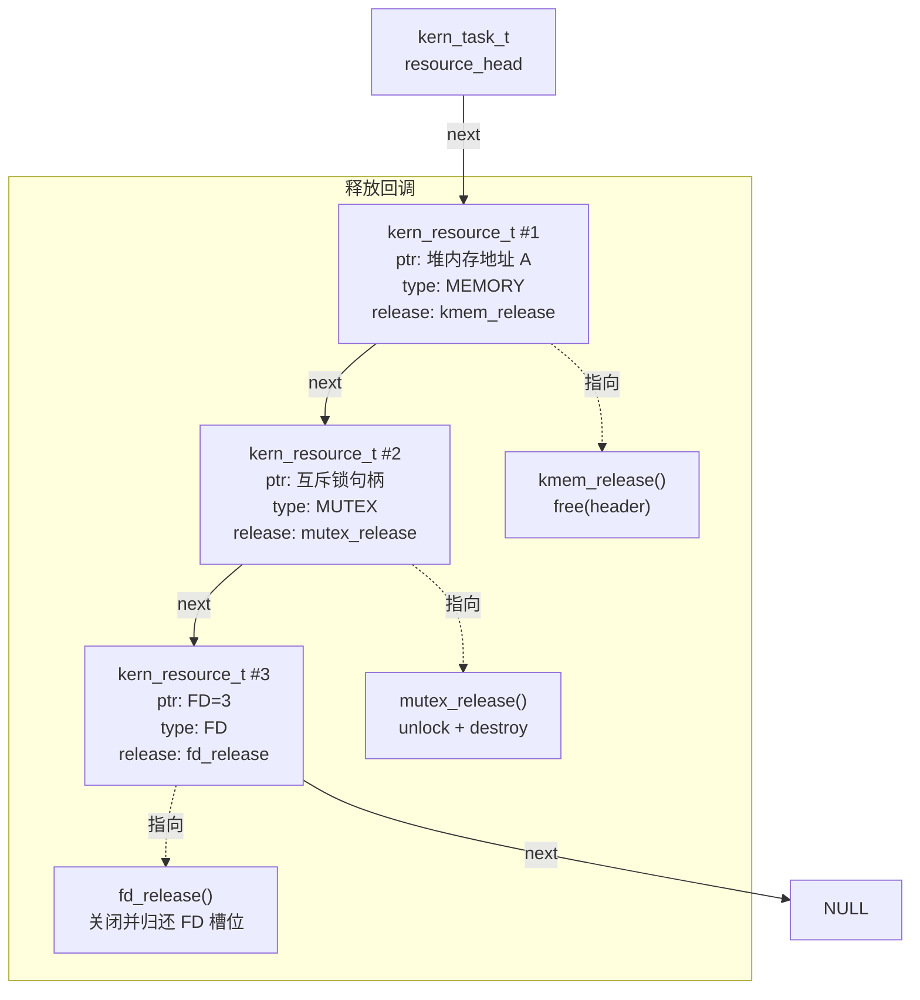

# 资源追踪系统（Kern Resource）

> **Parent:** [内核总览](index.md) | **Related:** [内核分配器](kern-kmalloc.md), [调度器](kern-task.md), [MPU 内存保护](kern-mpu.md)

## 概述

`kern_resource` 是 Xeros 内核的**统一资源生命周期管理系统**。每个任务可能持有内存、互斥锁、信号量、文件描述符等多种资源。当任务因 `kern_exit()` 退出或被 `kern_task_kill()` 终止时，如果这些资源没有被显式释放，就会造成泄漏。资源追踪系统的核心作用就是：**任务退出时自动回收其持有的全部资源**，无需资源持有者手动编写清理代码。

设计动机：嵌入式环境中没有操作系统级的资源回收机制，用户态代码一旦忘记 `kfree()` 或关闭文件，内存泄漏就会累积直至系统崩溃。有了这套追踪机制，开发者在任务入口函数中只需分配和打开，退出时内核自动回收——类似于 Rust 的 RAII，但在 C 语言层面以递归链表实现。

---

## 关键概念

### 资源类型枚举

*📄 Source: [kern_resource.h](../../src/kernel/kern_resource.h#L22-L28)*

```c
typedef enum {
    KERN_RES_MEMORY,      /* 堆分配 */
    KERN_RES_MUTEX,       /* 持有的互斥锁 */
    KERN_RES_SEMAPHORE,   /* 持有的信号量 */
    KERN_RES_FD,          /* 打开的文件描述符 */
    KERN_RES_FILE,        /* 打开的文件句柄 */
} kern_resource_type_t;
```

每种资源类型对应不同的释放行为：

| 类型 | 资源标识 (`ptr`) | 释放回调实际操作 |
|------|-----------------|-----------------|
| `KERN_RES_MEMORY` | 用户指针 | `free(header)` 释放完整分配块 |
| `KERN_RES_MUTEX` | 互斥锁句柄 | `mutex_unlock() + mutex_destroy()` |
| `KERN_RES_SEMAPHORE` | 信号量句柄 | `sem_destroy()` |
| `KERN_RES_FD` | 文件描述符编号 | 从 FD 表中移除并递减引用计数 |
| `KERN_RES_FILE` | 文件句柄指针 | `kern_file_close()` 关闭文件 |

### 资源追踪链表节点

*📄 Source: [kern_resource.h](../../src/kernel/kern_resource.h#L32-L37)*

```c
typedef struct kern_resource {
    void                  *ptr;      /* 资源标识指针 */
    kern_resource_type_t   type;     /* 资源类型 */
    void                 (*release)(void *ptr);  /* 释放回调 */
    struct kern_resource  *next;     /* 链表下一节点 */
} kern_resource_t;
```

每个资源追踪节点挂在任务的 `resource_head` 的单链表上。`ptr` 是资源的唯一标识（地址），用于后续定位和移除；`release` 回调在回收时被调用，负责真正的清理工作。为了避免 SMP 多核下并发修改同一任务的资源链表，TCB 中新增了 `resource_lock` 布尔自旋锁，`track/untrack/release_all` 都会在操作链表前后加锁/解锁。

### 资源节点对象池

*📄 Source: [kern_resource.c](../../src/kernel/kern_resource.c#L16-L51)*

```c
#define RES_POOL_SIZE 32  /* 预分配资源节点数 */

static kern_resource_t g_res_pool[RES_POOL_SIZE];
static uint32_t g_res_pool_bitmap;  /* 位图：bit i = 1 表示已分配 */

static kern_resource_t *res_pool_alloc(void) {
    for (int i = 0; i < RES_POOL_SIZE; i++) {
        if (!(g_res_pool_bitmap & (1UL << i))) {
            g_res_pool_bitmap |= (1UL << i);
            memset(&g_res_pool[i], 0, sizeof(kern_resource_t));
            return &g_res_pool[i];
        }
    }
    return NULL;  /* 池耗尽 */
}

static void res_pool_free(kern_resource_t *r) {
    if (r == NULL) return;
    int idx = (int)(r - g_res_pool);
    if (idx >= 0 && idx < RES_POOL_SIZE) {
        g_res_pool_bitmap &= ~(1UL << idx);
    }
}

static bool res_is_pooled(kern_resource_t *r) {
    if (r == NULL) return false;
    int idx = (int)(r - g_res_pool);
    return (idx >= 0 && idx < RES_POOL_SIZE);
}
```

为了减少资源节点自身频繁分配/释放带来的堆碎片和开销，`kern_resource` 内部维护了一个可容纳 32 个节点的静态对象池。`track()` 首先尝试从池中分配；只有在位图全满时，才回退到 `kern_kmalloc_untracked()` 从堆中分配。`untrack()` 和 `release_all()` 释放节点时，会根据节点地址判断它来自对象池还是堆，分别使用 `res_pool_free()` 或 `kern_kfree_untracked()`，避免错误释放。

### 资源链表在 TCB 中的位置

*📄 Source: [kern_task.h](../../src/kernel/kern_task.h#L85-L91)*

```c
typedef struct kern_task {
    /* ... 调度信息、栈管理、SMP 亲和性 ... */
    volatile bool resource_lock;         /* 保护 resource_head 的自旋锁 */
    struct kern_resource *resource_head; /* 持有的资源链表头 */

    /* 文件描述符表 */
    kern_file_t *fd_table[KERN_MAX_FD_PER_TASK]; /* 每任务独立的 FD 命名空间 */

    kern_mpu_config_t    *mpu_config;    /* 每任务 MPU 配置 */
} kern_task_t;
```

资源链表始终以**头插法**构建——新分配的资源插入链表头部，时间复杂度 O(1)。

---

## 资源生命周期完整链路

```
任务创建（kern_spawn）
    │
    │ resource_head = NULL ← 初始空链表
    ▼
运行时分配资源
    │
    │ kern_resource_track() → 插入链表头部
    │ kern_kmalloc()        → 自动调用 track
    │ kern_file_open()      → 自动调用 track
    ▼
任务退出（kern_exit）
    │
    │ kern_resource_release_all(task)
    │   ├── 遍历 resource_head 链表
    │   │     ├── cur->release(cur->ptr)  ← 调用释放回调
    │   │     └── free(cur)               ← 释放节点自身
    │   └── resource_head = NULL
    ▼
任务终止（kern_task_kill）
    │
    └── 同上，调用 kern_resource_release_all()
```

显式释放资源时（如 `kern_kfree()`），系统会先调用 `kern_resource_untrack()` 从链表中移除对应节点，避免后续 `release_all` 时重复释放。

---

## API 详解

### kern_resource_track — 追踪资源

*📄 Source: [kern_resource.c](../../src/kernel/kern_resource.c#L79-L106)*

```c
kern_err_t kern_resource_track(kern_task_t *task, void *ptr,
                        kern_resource_type_t type, void (*release)(void *))
{
    if (task == NULL || ptr == NULL || release == NULL) {
        return KERN_EINVAL;
    }

    kern_resource_t *res = res_pool_alloc();
    if (res == NULL) {
        /* 池耗尽：回退 kern_kmalloc_untracked */
        res = (kern_resource_t *)kern_kmalloc_untracked(sizeof(kern_resource_t));
    }
    if (res == NULL) {
        return KERN_ENOMEM;
    }

    res->ptr = ptr;
    res->type = type;
    res->release = release;

    /* 插入到资源链表头部 */
    _resource_lock(task);
    res->next = task->resource_head;
    task->resource_head = res;
    _resource_unlock(task);

    return KERN_OK;
}
```

#### 中文伪代码拆解

```
函数 追踪资源(任务, 资源指针, 资源类型, 释放回调) {
    if (任务为空 或 资源指针为空 或 释放回调为空) return 参数错误

    /* 对象池优先：避免频繁堆分配 */
    分配节点 = 对象池分配()
    if (分配节点为空) {
        分配节点 = 无追踪堆分配(sizeof(资源追踪节点))   // 池耗尽才回退
    }
    if (分配节点为空) return 内存不足

    初始化节点(资源指针, 类型, 释放回调)

    /* 头插法：将新节点插入链表头部 */
    加锁(任务.resource_lock)
    节点.下一节点 = 任务.资源链表头
    任务.资源链表头 = 节点
    解锁(任务.resource_lock)

    return 成功
}
```

**头插法图示**：

```
插入前:  resource_head → [节点A] → [节点B] → NULL

调用 kern_resource_track(task, ptr_c, ...)

插入后:  resource_head → [节点C] → [节点A] → [节点B] → NULL
```

### kern_resource_untrack — 移除追踪

*📄 Source: [kern_resource.c](../../src/kernel/kern_resource.c#L108-L137)*

从链表中查找并移除指定 `ptr` 对应的节点，释放追踪节点自身的内存。**注意**：此函数不调用资源的 `release` 回调——它只在资源已被显式释放后调用，仅负责清理追踪元数据。

#### 中文伪代码拆解

```
函数 取消追踪(任务, 资源指针) {
    if (任务为空 或 资源指针为空) return 参数错误

    前驱 = NULL
    当前节点 = 任务.资源链表头

    遍历链表 {
        if (当前节点.资源指针 == 目标资源指针) {
            /* 找到了：从链表中移除 */
            if (前驱 == NULL)
                任务.资源链表头 = 当前节点.下一节点   // 删除头节点
            else
                前驱.下一节点 = 当前节点.下一节点      // 删除中间节点

            释放节点(当前节点)                        // 池节点归还给对象池，堆节点用 kern_kfree_untracked
            return 成功
        }
        前驱 = 当前节点
        当前节点 = 当前节点.下一节点
    }

    return 资源未找到
}
```

### kern_resource_release_all — 全部回收

*📄 Source: [kern_resource.c](../../src/kernel/kern_resource.c#L139-L162)*

```c
void kern_resource_release_all(kern_task_t *task)
{
    if (task == NULL) return;

    _resource_lock(task);

    kern_resource_t *cur = task->resource_head;

    while (cur != NULL) {
        kern_resource_t *next = cur->next;

        /* 调用资源的释放回调 */
        if (cur->release != NULL && cur->ptr != NULL) {
            cur->release(cur->ptr);
        }

        kern_kfree_untracked(cur);
        cur = next;
    }

    task->resource_head = NULL;

    _resource_unlock(task);
}
```

#### 中文伪代码拆解

```
函数 释放全部资源(任务) {
    if (任务为空) return

    加锁(任务.resource_lock)

    当前节点 = 任务.资源链表头

    遍历链表 {
        保存下一节点 = 当前节点.下一节点   // 提前保存，释放后无法访问

        /* 步骤一：调用资源自身的清理函数 */
        if (当前节点.释放回调 不为空 且 当前节点.资源指针 不为空)
            当前节点.释放回调(当前节点.资源指针)

        /* 步骤二：释放追踪节点（根据来源归还对象池或堆） */
        释放节点(当前节点)

        当前节点 = 保存下一节点
    }

    任务.资源链表头 = NULL           // 清空链表，防止悬挂指针

    解锁(任务.resource_lock)
}
```

**核心思想**：遍历链表 → 调用每个资源的 release 回调（执行真正的资源清理）→ 释放链表节点本身 → 清空链表头。整个过程像剥洋葱一样从外到内逐层回收，确保不遗漏任何资源。

---

## 资源追踪链表结构图



---

## 与其他组件的关系

- **kern_kmalloc**：`kern_kmalloc()` 分配后自动调用 `kern_resource_track()`，`kern_kfree()` 释放前自动调用 `kern_resource_untrack()`。详见 [内核分配器](kern-kmalloc.md)。
- **kern_task**：`kern_exit()` 在销毁任务上下文前调用 `kern_resource_release_all()`，保证所有资源被回收。TCB 中 `resource_head` 字段是整个追踪系统的挂载点。
- **kern_vfs**：`kern_file_open()` 成功后，将 FD 和 FILE 两种资源都追踪到当前任务。关闭文件时 untrack。

---

> **See Also:** [内核分配器](kern-kmalloc.md) | [调度器与任务管理](kern-task.md) | [VFS 核心](kern-vfs.md) | [MPU 内存保护](kern-mpu.md)
